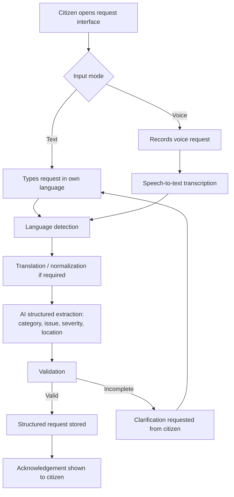
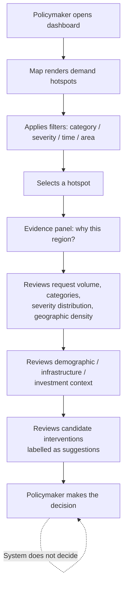

# Product Requirements Document

**Product name:** TBD — working name **"CivicSignal"** *(Proposed)*
**Document:** PRD.md
**Version:** 0.1 (Draft)
**Date:** TBD (hackathon build window ≈ 7 days)
**Status:** Draft — for hackathon MVP implementation
**Owner:** Product/Architecture lead (hackathon team)

> **Evidence classification used throughout this document**
>
> | Label | Meaning |
> |---|---|
> | **Confirmed** | Explicitly established in the project discussion / source context. |
> | **Derived** | A reasonable conclusion directly derived from Confirmed material. |
> | **Proposed** | A recommendation introduced by the documentation author to make the system implementation-ready. Not an existing project decision. |
> | **TBD** | Cannot be determined from the available project discussion. Must be decided by the team. |
>
> No item in this document is Confirmed unless it is explicitly labelled Confirmed.

---

## Table of Contents

1. [Product Overview](#1-product-overview)
2. [Users](#2-users)
3. [Product Scope](#3-product-scope)
4. [User Journeys](#4-user-journeys)
5. [Functional Requirements](#5-functional-requirements)
6. [Non-Functional Requirements](#6-non-functional-requirements)
7. [Acceptance Criteria](#7-acceptance-criteria)
8. [Dependencies](#8-dependencies)
9. [Risks and Constraints](#9-risks-and-constraints)
10. [Future Enhancements](#10-future-enhancements)
11. [Assumptions Register](#11-assumptions-register)
12. [Requirements Traceability Matrix](#12-requirements-traceability-matrix)

---

## 1. Product Overview

### 1.1 One-line description

**Confirmed (concept):** A multilingual civic intelligence platform that turns fragmented citizen voice/text development requests into structured, geographically contextualized, explainable evidence for public-sector planning.

### 1.2 Problem statement

**Confirmed.** Citizens communicate development and public-service needs through fragmented channels (voice, text, and potentially messaging platforms). Those requests are unstructured, multilingual, spread across channels, hard to categorize consistently, hard to aggregate geographically, hard to compare against demographic and infrastructure conditions, and hard to connect with existing investment plans.

This produces a gap:

```
Citizen-reported needs
        ↓
Structured evidence
        ↓
Geographic demand patterns
        ↓
Infrastructure/context analysis
        ↓
Government planning decisions
```

Each arrow in that chain is currently manual, inconsistent, or missing. The product exists to reduce that gap.

### 1.3 Challenge context

**Confirmed.** The project addresses a BRICS Digital Public Good challenge concerning scalable multilingual aggregation and analysis of citizen development requests. The system aggregates citizen requests and combines them with contextual information (demographic data, infrastructure indicators, geographic information, public investment/planning information) in order to surface geographic demand hotspots and provide evidence that helps national or regional policymakers understand where development needs concentrate and which interventions may be relevant.

**Confirmed constraint:** The system is a **decision-support platform**. It must not be represented as an autonomous system that makes government policy decisions. The policymaker remains responsible for deciding priorities.

### 1.4 Product vision

**Confirmed.** Create a multilingual civic intelligence platform that transforms fragmented citizen feedback into structured, geographically contextualized, explainable evidence for public-sector planning.

The platform should help a policymaker answer:

- What problems are citizens reporting?
- Where are these problems concentrated?
- How frequently are they being reported?
- How severe do the reported problems appear to be?
- Which demographic or geographic areas are affected?
- What infrastructure/contextual gaps exist?
- What public investments are already associated with the area?
- Why is this region being surfaced?
- What candidate interventions may address the identified need?

### 1.5 Product goals

| ID | Goal | Classification |
|---|---|---|
| G-01 | Accept citizen requests as text and voice and process them into structured civic issues. | Confirmed |
| G-02 | Handle a small set of languages end-to-end for the demonstration. | Confirmed (count ≈ 2–3); exact languages **TBD** |
| G-03 | Cluster requests semantically and associate them with geographic areas. | Confirmed |
| G-04 | Generate and visualize geographic demand hotspots on an interactive map. | Confirmed |
| G-05 | Join hotspots with demographic / infrastructure / investment context where data is available. | Confirmed |
| G-06 | Explain, from observable evidence, why a region is surfaced. | Confirmed |
| G-07 | Surface candidate interventions as decision-support signals, never as decisions. | Confirmed (mechanism **TBD/Proposed**) |
| G-08 | Remain buildable and demo-reliable within ≈7 days by a small team. | Confirmed |

### 1.6 Success criteria (MVP)

| ID | Success criterion | Classification |
|---|---|---|
| SC-01 | A live, unscripted citizen submission (text) flows end-to-end and appears in the dashboard aggregation after processing. | Derived from Confirmed MVP flow |
| SC-02 | A live voice submission is transcribed, processed, and produces a structured request. | Derived |
| SC-03 | Requests in each supported language produce a structured issue with category, issue text, severity and location. | Derived |
| SC-04 | The dashboard renders hotspots on a map for the demo geography from the seeded dataset. | Derived |
| SC-05 | Selecting a hotspot shows an evidence panel that lists the concrete signals behind it (counts, categories, severity distribution, density, context). | Derived |
| SC-06 | No screen presents a priority signal without an accompanying evidence breakdown. | Confirmed principle ("Do not create an opaque AI score without explanation") |
| SC-07 | Every AI-generated intervention suggestion is visibly labelled as a suggestion requiring human decision. | Confirmed principle |
| SC-08 | The full demo path can be executed without an external AI call at demo time (pre-processed dataset available as fallback). | Proposed — demo-reliability measure |

---

## 2. Users

### 2.1 Target users

**Confirmed.**

**Primary users**
- Policymakers
- Government planning officials
- Infrastructure/public-service planners
- Analysts investigating regional demand

**Secondary user**
- Citizens submitting civic/development requests

**Confirmed scope note:** For the hackathon MVP the policymaker/planner dashboard is the primary analytical experience. No additional user roles are introduced. Any operational role needed to run the demo (e.g. seeding data) is treated as a **Proposed** internal/demo role, not a product persona.

### 2.2 User roles

| Role ID | Role | Access in MVP | Classification |
|---|---|---|---|
| ROLE-01 | Citizen (submitter) | Submit text/voice request; see submission acknowledgement and processing state. | Derived |
| ROLE-02 | Policymaker / Planner / Analyst | Read-only analytical access to dashboard, map, hotspots, evidence, context, candidate interventions. | Derived |
| ROLE-03 | Demo operator / seeder | Load or recompute the synthetic dataset. | **Proposed** (needed to run the demo) |

**Authentication note (Confirmed constraint):** no authentication/authorization model has been established. Role separation in the MVP is therefore **route-level only, not enforced by identity** — see FR-016 and NFR-004.

### 2.3 Personas

**Classification: Derived** — personas are narrative expansions of the Confirmed user list. No demographic or biographical facts are asserted.

**P-01 — Regional planning official (primary)**
- Responsible for prioritizing public-service and infrastructure interventions across many areas.
- Receives citizen feedback in inconsistent forms and volumes.
- **Needs:** a defensible, inspectable view of where demand concentrates and why.
- **Pain:** cannot justify a prioritization decision from raw, fragmented feedback.
- **Job to be done:** *When I plan the next cycle of interventions, I want to see where citizen demand concentrates and what context surrounds it, so I can defend a prioritization decision with evidence.*

**P-02 — Sector/infrastructure planner (primary)**
- Focused on a category of service (e.g. water, roads, sanitation — categories themselves are **TBD**).
- **Needs:** filtering by issue category and severity; comparison against infrastructure indicators and existing investments.
- **Job to be done:** *When I review my sector, I want to find areas where reported demand is high and existing provision or investment appears not to match, so I can shortlist candidate locations.*

**P-03 — Analyst (primary)**
- Investigates a region in depth and prepares material for decision-makers.
- **Needs:** traceability from a hotspot down to the underlying requests and signals.
- **Job to be done:** *When I am asked "why this region?", I want to open the underlying evidence, so I can verify the claim rather than trust a score.*

**P-04 — Citizen submitter (secondary)**
- Reports a development or public-service need, possibly by speaking in their own language.
- **Needs:** submit without filling a complex structured form; confidence the submission was received.
- **Job to be done:** *When I have a problem in my area, I want to describe it in my own words and language, so it is recorded and counted.*

### 2.4 Pain points

**Confirmed.**

**Citizen-side**
- Difficulty communicating issues in a structured format.
- Language barriers.
- Unstructured submissions.
- Lack of visibility into how requests are analyzed.

**Policymaker/planner-side**
- Fragmented citizen feedback.
- High volume of unstructured requests.
- Difficulty identifying geographic demand concentrations.
- Difficulty connecting citizen demand with contextual infrastructure/demographic data.
- Difficulty understanding why a region is being highlighted.
- Difficulty comparing citizen demand with existing investment/planning information.

---

## 3. Product Scope

### 3.1 MVP constraints (Confirmed)

- ≈7 days of build time.
- Small hackathon team.
- Demonstrable prototype, not production software.
- One country/region (exact demo geography **TBD**).
- Approximately 2–3 supported languages (exact languages **TBD**).
- Synthetic / curated / public datasets only.

### 3.2 In scope (MVP)

| Area | Included | Classification |
|---|---|---|
| Citizen request intake | Text and voice | Confirmed |
| Speech-to-text | Voice converted to text via a speech-to-text service (provider **TBD**) | Confirmed capability, **TBD** provider |
| Multilingual handling | Language detection; translation/normalization where required | Confirmed |
| Structured extraction | Language, category, issue, severity, location | Confirmed |
| Semantic clustering | Grouping semantically similar requests | Confirmed |
| Geographic association | Associating requests with geographic areas | Confirmed |
| Hotspot detection | Identifying areas of concentrated demand | Confirmed (algorithm **Proposed/TBD**) |
| Geospatial visualization | Interactive map, Leaflet | Confirmed direction |
| Context overlay | Demographic, infrastructure, geographic, and investment data *where available* | Confirmed |
| Explainable evidence | "Why is this region being surfaced?" from observable signals | Confirmed |
| Candidate interventions | Decision-support suggestions only | Confirmed intent, **TBD** mechanism |

### 3.3 Optional (build only if time remains)

**Classification: Derived from the Confirmed differentiator list, which explicitly states not all five belong in the MVP.**

| ID | Item | Note |
|---|---|---|
| OPT-01 | Citizen-request → project/intervention traceability | Listed as a considered differentiator; not selected for MVP. |
| OPT-02 | Intervention/scenario simulation | Explicitly flagged as possibly future scope. |
| OPT-03 | Natural-language policymaker queries | Explicitly flagged as possibly future scope. |
| OPT-04 | Citizen-facing status lookup after submission | **Proposed** — addresses the Confirmed citizen pain point "lack of visibility into how requests are analyzed"; low cost. |

**Confirmed:** the strongest MVP-compatible differentiator is **explainable civic demand intelligence** (items 1 and 2 of the differentiator list). The MVP commits to that; OPT-01…OPT-03 are not MVP requirements.

### 3.4 Out of scope (Confirmed — must not become MVP requirements)

- Full BRICS-wide rollout
- 20+ language support
- Real government-system integrations
- Autonomous government decisions
- Complex predictive forecasting
- Satellite imagery / computer-vision analysis
- Building a custom LLM
- Full social-media ecosystem ingestion
- Complex messaging-platform integrations (unless explicitly selected — currently **not** selected)
- Full government workflow management
- Full impact measurement
- Overly complex ML pipelines
- Production-scale infrastructure unnecessary for the hackathon

### 3.5 Future scope

See [§10 Future Enhancements](#10-future-enhancements). Everything in §3.4 may be revisited there, but nothing in §3.4 is an MVP requirement.

---

## 4. User Journeys

### 4.1 UC-001 / UC-002 — Citizen request journey

**Confirmed flow.**



Covers **UC-001** (text submission) and **UC-002** (voice submission).

### 4.2 UC-003 → UC-006 — Policymaker journey

**Confirmed flow.**



### 4.3 End-to-end MVP flow (Confirmed — must be preserved)

1. Citizen submits a text or voice request.
2. Voice input is transcribed.
3. Language is detected/handled.
4. Translation/normalization applied where required.
5. AI extracts structured information (category, issue, severity, location).
6. Requests are semantically clustered.
7. Requests are geographically associated.
8. Geographic demand hotspots are generated.
9. Hotspots are visualized on a map.
10. Relevant demographic/infrastructure/investment context is shown.
11. The policymaker inspects evidence explaining why the area was surfaced.
12. Candidate interventions or priority signals may be presented.
13. The policymaker makes the final decision.

---

## 5. Functional Requirements

> Priority scale: **P0** = MVP-critical (demo fails without it) · **P1** = MVP, degradable · **P2** = optional if time remains.

---

### FR-001 — Citizen text request intake

- **Feature:** Citizen Request Intake (text)
- **Classification:** Confirmed
- **Purpose:** Let a citizen describe a development/public-service need in free text in their own language.
- **User story:** As a citizen, I want to type my problem in my own language so that it is recorded without me having to fit it into a structured form.
- **Preconditions:** Citizen request interface reachable. No authentication required (Confirmed: none established).
- **User flow:** Open interface → select/confirm language (or leave auto) → type request → optionally provide location → submit.
- **Inputs:** Free-text body (required); citizen-provided location hint (optional — see FR-008); language selection (optional).
- **Expected behavior:** Request is accepted, assigned an identifier, persisted in raw form before any AI processing, and queued/processed for structuring.
- **Outputs:** Request identifier; acknowledgement state; raw request record.
- **Success conditions:** Raw request is durably stored even if downstream AI processing fails.
- **Edge cases:** empty/whitespace-only text; text below a minimum useful length (threshold **TBD**); text exceeding maximum length (limit **Proposed**, value **TBD**); unsupported language detected (see FR-004); duplicate rapid submissions.
- **Priority:** P0

---

### FR-002 — Citizen voice request intake

- **Feature:** Citizen Request Intake (voice)
- **Classification:** Confirmed
- **Purpose:** Let a citizen speak their request instead of typing it.
- **User story:** As a citizen who finds writing difficult, I want to speak my request so that I can still report a need.
- **Preconditions:** Browser microphone permission granted, or an audio file supplied.
- **User flow:** Open interface → choose voice → record (or upload sample) → review duration → submit.
- **Inputs:** Audio capture from browser; supported formats/codecs **TBD**; maximum duration **Proposed**, value **TBD**.
- **Expected behavior:** Audio is transmitted to the backend, persisted or held for transcription (retention policy **TBD** — see NFR-010), and passed to FR-003.
- **Outputs:** Request identifier; transcription result (from FR-003).
- **Success conditions:** A voice request produces a stored raw request whose transcript is attached once available.
- **Edge cases:** microphone permission denied → fall back to text input; silent or extremely short recording; very noisy audio; unsupported browser; upload interrupted.
- **Priority:** P0

---

### FR-003 — Speech-to-text transcription

- **Feature:** Speech Processing
- **Classification:** Confirmed capability; **provider/model TBD** (do not assume one)
- **Purpose:** Convert voice requests into text so the same downstream pipeline serves both modes.
- **User story:** As the system, I need spoken requests as text so that extraction and clustering work identically for voice and text.
- **Preconditions:** Audio received (FR-002); speech-to-text service credentials configured.
- **User flow:** Backend submits audio → receives transcript → attaches transcript to the raw request.
- **Inputs:** Audio payload; optional language hint.
- **Expected behavior:** Transcript produced and stored alongside the original request with an indication that it is machine-generated.
- **Outputs:** Transcript text; detected/declared language if the service returns it; confidence if available (**TBD** — depends on provider).
- **Success conditions:** Transcript is stored and the request continues to FR-004; failure leaves the raw audio request recoverable and marked as failed rather than lost.
- **Edge cases:** provider unavailable or rate-limited; unsupported language; empty transcript; low-confidence transcript (surfacing threshold **TBD**).
- **Priority:** P0

---

### FR-004 — Language detection, translation and normalization

- **Feature:** Multilingual Processing
- **Classification:** Confirmed; supported language *set* **TBD**; count ≈2–3 Confirmed
- **Purpose:** Handle requests written or spoken in the supported languages and normalize them for consistent downstream processing.
- **User story:** As a citizen, I want to use my own language so that I am not excluded by a language barrier.
- **Preconditions:** Text available (typed or transcribed).
- **User flow:** Detect language → if not the pivot/working language, translate or normalize → retain the original text unchanged.
- **Inputs:** Raw text or transcript.
- **Expected behavior:** Detected language recorded; a normalized working text produced where required; the original text is never overwritten.
- **Outputs:** `language` field; normalized text; translation provenance flag.
- **Success conditions:** Both original and normalized text are retrievable; the dashboard can display the original.
- **Edge cases:** mixed-language text; code-switching; detection confidence low; language outside the supported set (behavior **Proposed**: accept, flag as unsupported, attempt best-effort extraction, exclude from language-specific quality claims).
- **Priority:** P0

---

### FR-005 — AI structured issue extraction

- **Feature:** Structured Issue Extraction
- **Classification:** Confirmed (fields Confirmed; provider/model **TBD**)
- **Purpose:** Convert unstructured citizen text into a structured civic issue record.
- **User story:** As a planner, I want each request to carry a category, issue summary, severity and location so that requests can be counted and compared.
- **Preconditions:** Normalized text available (FR-004).
- **User flow:** Backend prompts the AI service with the normalized text → receives a structured object → validates it against the expected shape → stores it.
- **Inputs:** Normalized text; category taxonomy (taxonomy contents **TBD**); supported severity scale (scale **Proposed**, values **TBD**).
- **Expected behavior:** Extraction returns exactly the fields the product needs: `language`, `category`, `issue`, `severity`, `location`. No additional speculative fields are introduced (Confirmed: "only fields actually needed by the product should be included").
- **Outputs:** Structured request record linked to the raw request.
- **Success conditions:** Output passes schema validation; invalid or partial output is marked `extraction_failed` rather than silently coerced.
- **Edge cases:** model returns malformed JSON; category outside the taxonomy; severity absent; location absent or ambiguous (→ FR-008); text is not a civic request at all (out-of-scope content — handling **Proposed**: flag and exclude from hotspots).
- **Priority:** P0

---

### FR-006 — Request validation and persistence

- **Feature:** Request lifecycle
- **Classification:** Derived (required by the Confirmed flow step "requests are… stored")
- **Purpose:** Guarantee that raw and processed requests are persisted with an explicit processing state.
- **User story:** As the team, I need every submission to have a recoverable state so that a failed AI call does not lose citizen input during the demo.
- **Preconditions:** None beyond a reachable database.
- **User flow:** Persist raw → set state `received` → advance through `transcribed` / `normalized` / `extracted` / `geolocated` / `failed`.
- **Inputs:** Raw request, pipeline stage outputs.
- **Expected behavior:** State transitions are recorded; failures are recorded with a stage and reason.
- **Outputs:** Persisted `CitizenRequest` and `ProcessedRequest` records (see TAD DE-001, DE-002).
- **Success conditions:** Every submitted request can be found by identifier with a defined state.
- **Edge cases:** database unavailable at submit time (behavior **Proposed:** return an explicit error to the citizen rather than a false success).
- **Priority:** P0

---

### FR-007 — Semantic clustering of requests

- **Feature:** Semantic Clustering
- **Classification:** Confirmed (capability); embedding provider **TBD**; clustering method **Proposed**
- **Purpose:** Group semantically similar citizen requests so that the same underlying problem expressed in different words or languages is counted together.
- **User story:** As an analyst, I want "no water in the taps" and an equivalent phrase in another language to be recognized as the same kind of issue so that volume is not fragmented.
- **Preconditions:** Structured requests with normalized text (FR-005).
- **User flow:** Generate embeddings → group by similarity → attach a cluster/theme identifier to each processed request.
- **Inputs:** Normalized text and/or extracted issue text; extracted category.
- **Expected behavior:** Each processed request receives a semantic group reference; grouping is recomputable.
- **Outputs:** Cluster/theme identifier; representative label for the group (labelling method **Proposed/TBD**).
- **Success conditions:** Requests that are paraphrases of one another, including across supported languages, fall in the same group in the seeded dataset.
- **Edge cases:** singleton requests; very short text yielding weak embeddings; embedding service unavailable (**Proposed** fallback: fall back to the extracted category alone and mark the grouping as category-only).
- **Priority:** P0

---

### FR-008 — Geographic association

- **Feature:** Geographic Association / Geocoding
- **Classification:** Confirmed (capability); OpenStreetMap/geocoding is the Confirmed direction; **exact geocoding service TBD**
- **Purpose:** Attach each request to a geographic area so requests can be aggregated spatially.
- **User story:** As a planner, I want requests tied to areas so that I can see where demand concentrates.
- **Preconditions:** A location signal exists — extracted location text (FR-005), a citizen-selected point/area, or device geolocation if offered.
- **User flow:** Resolve location text or coordinates → match to a known geographic area from the reference set → store both point (if available) and area reference.
- **Inputs:** Location string, coordinates, or area selection; reference geographic areas (≈20–100 areas, Confirmed range).
- **Expected behavior:** Request is associated with exactly one area where resolvable; unresolved requests are marked `location_unresolved` and excluded from hotspot aggregation while remaining visible in counts of unresolved input.
- **Outputs:** `area_id`, optional coordinates, resolution method and confidence (confidence availability **TBD**).
- **Success conditions:** A defined and reported share of seeded requests resolve to areas; unresolved requests are never silently assigned to a default area.
- **Edge cases:** ambiguous place names; names outside the demo geography; geocoder unavailable or rate-limited; citizen gives no location at all; coordinates outside the demo region.
- **Priority:** P0

---

### FR-009 — Hotspot detection and aggregation

- **Feature:** Hotspot Detection
- **Classification:** Confirmed (capability). **Algorithm: Proposed.** Deterministic aggregation is the recommended MVP default; DBSCAN is a candidate approach, not mandatory.
- **Purpose:** Identify geographic areas with concentrated demand.
- **User story:** As a policymaker, I want to see where demand concentrates so that I can focus my attention.
- **Preconditions:** Processed requests with area association (FR-008) and semantic grouping (FR-007).
- **User flow:** Group by area (and optionally by category/theme) → aggregate counts and severity → evaluate against a concentration rule → emit hotspot candidates with their evidence.
- **Inputs:** Processed requests; geographic areas; optional population/context denominators (FR-011).
- **Expected behavior:** Produces a set of hotspots, each carrying the raw aggregates that justify it. **Confirmed constraint:** no opaque composite score without an explanation; if a ranked signal is shown, its inputs must be displayed (see FR-012).
- **Outputs:** Hotspot records: area, dominant category/theme, request count, severity distribution, time window, contributing request references.
- **Success conditions:** Every hotspot can be decomposed into the requests and aggregates that produced it.
- **Edge cases:** very sparse areas; a single high-severity request; areas with no population denominator; ties; recomputation while the dashboard is open.
- **Priority:** P0
- **Notes:** Complex predictive ML is explicitly out of scope (Confirmed).

---

### FR-010 — Geospatial visualization

- **Feature:** Map / hotspot visualization
- **Classification:** Confirmed (Leaflet is the Confirmed frontend direction)
- **Purpose:** Present hotspots geographically so spatial patterns are immediately legible.
- **User story:** As a policymaker, I want to see hotspots on a map so that I can understand the geography of demand at a glance.
- **Preconditions:** Hotspots available (FR-009).
- **User flow:** Open dashboard → map loads with the demo geography → hotspots render as area shading and/or markers → hover/focus for summary → select for detail.
- **Inputs:** Hotspot list; geographic area geometry (source **TBD** — OpenStreetMap-derived is the direction).
- **Expected behavior:** Interactive pan/zoom; visual encoding of intensity; selection drives the detail panel.
- **Outputs:** Rendered map; selection events.
- **Success conditions:** Hotspots are distinguishable at the default zoom for the demo geography; selection reliably opens the corresponding evidence.
- **Edge cases:** no hotspots for current filters; tile server unreachable; geometry missing for an area (**Proposed** fallback: render a point marker at the area centroid and flag reduced fidelity); very many overlapping markers.
- **Accessibility requirement:** map information must also be available in a non-map form (see NFR-005 and FR-014).
- **Priority:** P0

---

### FR-011 — Contextual data overlay

- **Feature:** Context Overlay
- **Classification:** Confirmed (capability). **Each specific dataset is TBD / requires verification.**
- **Purpose:** Place citizen demand next to demographic, infrastructure, geographic and investment context.
- **User story:** As a planner, I want to see who lives in the area and what infrastructure and investment already exist so that I can interpret the demand signal.
- **Preconditions:** Hotspot selected; context data loaded for that area (availability varies by dataset).
- **User flow:** Select hotspot → context section shows the available indicators for the area with the source and vintage for each.
- **Inputs:**
  - Population/demographic information — public demographic data; Census 2011 where appropriate (Confirmed as *potential* sources; specific extract **TBD**).
  - Infrastructure indicators — OpenStreetMap-derived and/or public infrastructure data *where accessible* (**TBD**).
  - Public investment/planning information *where accessible* (**TBD — requires verification**).
- **Expected behavior:** Every indicator displays its provenance label: **Synthetic**, **Public**, **Curated/mock**, or **Not available**. Missing data renders as an explicit "not available for this area", never as zero.
- **Outputs:** Context block per area.
- **Success conditions:** No indicator is displayed without a source label; absence is visibly distinguished from a zero value.
- **Edge cases:** partial coverage across areas; mismatched administrative boundaries between datasets; stale vintages.
- **Priority:** P1 (P0 for at least one demographic indicator; other categories degrade gracefully)
- **⚠ Explicit constraint (Confirmed):** a JJM API/download was discussed but **access was not verified**. It must be referenced only as **TBD / requires verification**, never as an existing integration. The same rule applies to any other public investment API or infrastructure dataset that has not been confirmed.

---

### FR-012 — Explainable evidence ("Why this region?")

- **Feature:** Explainability
- **Classification:** Confirmed — this is the selected core differentiator
- **Purpose:** Let a policymaker see exactly which observable signals caused an area to be surfaced.
- **User story:** As a policymaker, I want to know why this region is highlighted so that I can trust or challenge the finding.
- **Preconditions:** Hotspot selected.
- **User flow:** Select hotspot → "Why this region?" section lists each contributing signal with its value → drill into the contributing citizen requests.
- **Inputs:** Hotspot aggregates (FR-009); context (FR-011).
- **Expected behavior:** The explanation enumerates the signals **actually used**, with values: number of requests; issue categories present and their shares; severity distribution; geographic concentration; demographic/context information; infrastructure gaps; relevant investment information where available. Any signal not used or not available is stated as such.
- **Outputs:** Evidence breakdown; list of contributing requests (original text preserved, plus translation where applicable).
- **Success conditions:** A reviewer can reconstruct the reason for the hotspot from the panel alone, without reading code.
- **Edge cases:** a single signal dominates; contradictory signals; context unavailable (explanation must still stand on the request-derived signals and say what is missing).
- **Priority:** P0
- **Confirmed prohibition:** no opaque AI score; no claim of objective policy correctness.

---

### FR-013 — Candidate interventions

- **Feature:** Candidate Interventions
- **Classification:** Confirmed intent; **generation mechanism Proposed/TBD**
- **Purpose:** Offer possible interventions relevant to the identified problem and context as a decision-support signal.
- **User story:** As a planner, I want a starting shortlist of possible responses so that I can begin evaluation faster.
- **Preconditions:** Hotspot with evidence available.
- **User flow:** Open hotspot detail → candidate interventions section → each candidate shows what it responds to → policymaker decides.
- **Inputs:** Hotspot category/theme, severity profile, context indicators.
- **Expected behavior:** Candidates are presented as **suggestions**, each visibly tied to the evidence that motivated it and labelled as AI-assisted where AI generated it.
- **Outputs:** Ordered list of candidate interventions with rationale text.
- **Success conditions:** Every candidate is accompanied by (a) a rationale referencing named evidence and (b) a clear non-authoritative label.
- **Edge cases:** no confident candidate (**Proposed:** show nothing rather than a filler suggestion); generation service unavailable (degrade to a curated mapping from category → candidate list, labelled **Curated/mock**).
- **Priority:** P1
- **Confirmed prohibition:** must not be presented as an authoritative government decision.

---

### FR-014 — Hotspot exploration, filtering and non-map listing

- **Feature:** Dashboard exploration
- **Classification:** Derived (required by the Confirmed policymaker journey and by the Confirmed accessibility requirement for map alternatives)
- **Purpose:** Let users narrow and browse hotspots, including without using the map.
- **User story:** As an analyst, I want to filter by category and severity and read hotspots as a ranked list so that I can work efficiently and without a mouse.
- **Preconditions:** Hotspots available.
- **User flow:** Apply filters → map and list update together → select from either → detail opens.
- **Inputs:** Filter selections — category, severity, area, time window (available filter dimensions **Proposed**; final set **TBD**).
- **Expected behavior:** Map view and list view are two renderings of the same filtered result set and never disagree.
- **Outputs:** Filtered hotspot collection.
- **Success conditions:** The full evidence workflow is completable using the list view and keyboard only.
- **Edge cases:** filter combination yields zero results; filters applied while data is refreshing.
- **Priority:** P0 (list view is the accessibility alternative required by NFR-005)

---

### FR-015 — Citizen submission feedback

- **Feature:** Submission acknowledgement / processing state
- **Classification:** Derived (addresses the Confirmed citizen pain point "lack of visibility into how requests are analyzed")
- **Purpose:** Tell the citizen their request was received and, at a high level, what happened to it.
- **User story:** As a citizen, I want confirmation that my request was received and understood so that I know it counts.
- **Preconditions:** Submission completed.
- **User flow:** Submit → processing indicator → confirmation showing the structured interpretation (category, issue summary, severity, resolved area) for the citizen to sanity-check.
- **Inputs:** Request identifier.
- **Expected behavior:** Confirmation shows the interpretation; if extraction failed, it says the request was received but not yet structured.
- **Outputs:** Confirmation view.
- **Success conditions:** No submission ends in an ambiguous state.
- **Edge cases:** processing slower than the user's patience (**Proposed:** show "received — still processing" rather than blocking); user navigates away.
- **Priority:** P1

---

### FR-016 — Dataset seeding and recomputation (demo operation)

- **Feature:** Demo data lifecycle
- **Classification:** **Proposed** — required to run the demo; not a stated product feature
- **Purpose:** Load the synthetic/curated dataset and (re)generate clusters and hotspots.
- **User story:** As the demo operator, I want to seed and recompute so that the dashboard is populated reliably during the demo.
- **Preconditions:** Dataset files present.
- **User flow:** Run a seed/recompute operation (CLI script preferred over an exposed endpoint — see NFR-004).
- **Inputs:** Synthetic requests (1,000–2,000), voice samples (50–200), labelled evaluation examples (≈100), geographic areas (≈20–100) — all Confirmed as the dataset strategy.
- **Expected behavior:** Idempotent seeding; recompute regenerates clusters and hotspots from stored processed requests without re-calling AI services.
- **Outputs:** Populated collections.
- **Success conditions:** A cold environment can be brought to demo-ready state by a documented command.
- **Edge cases:** partial seed; re-seed over existing data.
- **Priority:** P0 (for demo reliability)
- **Security note:** if exposed over HTTP rather than as a script, it must be protected — mechanism **TBD** (no authentication model established).

---

## 6. Non-Functional Requirements

> **Confirmed rule:** do not create arbitrary numerical targets. Where a measurable target is useful but not established, it is marked **Proposed/TBD** and must be set by the team against the real environment.

| ID | Category | Requirement | Classification |
|---|---|---|---|
| **NFR-001** | Performance — interactive reads | Dashboard read operations (hotspot list, hotspot detail, context) must feel interactive on the seeded dataset (≈20–100 areas, ≤2,000 requests). A concrete latency budget is **Proposed/TBD** and must be measured, not assumed. Hotspots are precomputed rather than derived per request. | Derived + **Proposed** |
| **NFR-002** | Performance — AI pipeline | Submission-time AI work (transcription, translation, extraction) is network-bound and must not block the UI. The submit response must return as soon as the raw request is persisted; structuring completes asynchronously or with a visible processing state. Target latency **TBD** (provider-dependent). | Derived |
| **NFR-003** | Scalability | The backend must be structured as a modular monolith whose ingestion, AI processing, clustering, hotspot generation and context enrichment are independently testable modules, so that heavier processing can later be moved out without rewriting the product. Horizontal scaling, distributed queues, microservices and Kubernetes are **out of scope for the MVP**. | Confirmed (direction) |
| **NFR-004** | Security | Input validation on all endpoints; injection and XSS prevention; secrets (AI provider keys, database credentials) held in environment variables and never in the client bundle or repository; CORS restricted to known origins; AI-generated text treated as untrusted content and never rendered as raw HTML. Rate limiting is **Recommended**, not implemented. Authentication/authorization: **none established — TBD**. | Mixed — see §Security in TAD |
| **NFR-005** | Accessibility | Keyboard navigation for all interactive elements; semantic HTML; visible focus states; colour contrast meeting WCAG 2.1 AA as a target (**Proposed** target level); screen-reader-compatible labelling; accessible form controls; **map information must have a non-map equivalent** (FR-014 list view), since Leaflet map content is not reliably screen-reader accessible. | Confirmed (topics) + **Proposed** (AA target) |
| **NFR-006** | Responsiveness | Usable on desktop, tablet and mobile. The policymaker dashboard may be desktop-first because it is analytical and map-heavy, but core workflows must remain usable on smaller viewports; the citizen request interface is mobile-first. | Confirmed |
| **NFR-007** | Reliability (demo) | The demo path must not depend on an unguaranteed external call succeeding live. Pre-processed seeded data must be able to carry the dashboard even if an AI or geocoding provider fails during the demo. Every external call must have a defined failure behavior visible in the UI. | **Proposed** (demo-risk control) |
| **NFR-008** | Maintainability | Clear module boundaries; typed frontend (TypeScript, Confirmed); typed request/response models on the backend (FastAPI + Pydantic, **Derived** from the Confirmed FastAPI choice); no speculative abstraction layers. | Derived |
| **NFR-009** | Compatibility | Current evergreen desktop and mobile browsers. Voice capture requires a browser with microphone access; exact supported browser matrix **TBD**; a text fallback must exist wherever voice is unavailable. | Derived |
| **NFR-010** | Data minimization & citizen data protection | Collect only what the product uses (FR-005 fields plus location). Do not request personal identifiers. Audio retention period **TBD**; retaining audio beyond transcription must be an explicit decision. Synthetic data must be labelled as synthetic everywhere it is displayed. | Confirmed (topic) + **TBD** |
| **NFR-011** | Observability | Structured application logging with a request/correlation identifier through the pipeline; health check endpoint; explicit error logging for every external service call. No monitoring/APM product is selected — **TBD**. | **Proposed** |
| **NFR-012** | Explainability transparency | The system must never display a priority signal without the signals that produced it, and must state which signals were used and which were unavailable. | Confirmed |

---

## 7. Acceptance Criteria

Written to be testable. Each maps to requirements.

| ID | Acceptance criterion | Verifies |
|---|---|---|
| AC-001 | Submitting a non-empty text request returns a request identifier and the request is retrievable with a state of at least `received`. | FR-001, FR-006 |
| AC-002 | Submitting an empty or whitespace-only text request is rejected with a field-level message and no record is created. | FR-001 |
| AC-003 | Recording and submitting audio produces a request whose stored record contains a transcript, or an explicit `transcription_failed` state. | FR-002, FR-003 |
| AC-004 | Denying microphone permission leaves the citizen able to complete a text submission without reloading the page. | FR-002, NFR-007 |
| AC-005 | For each supported language, a seeded request in that language yields a stored `language` value matching the expected label in the ≈100-example labelled evaluation set. | FR-004 |
| AC-006 | Extraction output that does not satisfy the expected field shape results in state `extraction_failed`; no partially coerced record is written. | FR-005, FR-006 |
| AC-007 | A structured request contains all five fields: language, category, issue, severity, location (location may be explicitly null with state `location_unresolved`). | FR-005 |
| AC-008 | Paraphrased request pairs in the labelled evaluation set that express the same issue receive the same semantic group identifier. | FR-007 |
| AC-009 | A request whose location cannot be resolved is stored with `location_unresolved` and does not appear in any hotspot aggregate. | FR-008, FR-009 |
| AC-010 | Every hotspot returned by the API includes: request count, category breakdown, severity distribution, and the identifiers of contributing requests. | FR-009, FR-012 |
| AC-011 | Opening the dashboard renders the demo geography with all hotspots for the default filters; the count on the map equals the count in the list view. | FR-010, FR-014 |
| AC-012 | Applying a filter updates map and list simultaneously; a filter combination with no matches shows an empty state, not an error. | FR-014 |
| AC-013 | Selecting any hotspot opens an evidence panel naming every signal used, with its value, and explicitly listing signals that were unavailable. | FR-012, NFR-012 |
| AC-014 | Every context indicator displayed carries a provenance label of Synthetic, Public, Curated/mock, or Not available. | FR-011 |
| AC-015 | No screen anywhere references an investment or infrastructure data source as an available integration unless it has been verified; unverified sources display as "TBD / requires verification". | FR-011 (Confirmed constraint) |
| AC-016 | Every candidate intervention displays a rationale referencing named evidence and a label indicating it is a suggestion for human decision. | FR-013 |
| AC-017 | The complete policymaker workflow — filter, select hotspot, read evidence, read context, read candidates — is completable using keyboard only via the list view. | FR-014, NFR-005 |
| AC-018 | All interactive controls have visible focus indicators and accessible names; automated accessibility checks report no critical violations on the dashboard and citizen pages (tool **TBD**). | NFR-005 |
| AC-019 | The citizen interface is usable at a mobile viewport width without horizontal scrolling; the dashboard remains operable at tablet width with the detail panel reflowing below or over the map. | NFR-006 |
| AC-020 | No API key or provider secret appears in the frontend bundle or in the repository. | NFR-004 |
| AC-021 | With all external AI and geocoding providers unreachable, the dashboard still renders seeded hotspots and evidence, and the citizen submission path reports a clear, non-crashing error. | NFR-007 |
| AC-022 | A documented single command brings a clean environment to a populated, demo-ready state. | FR-016 |
| AC-023 | The health check endpoint returns a success response and reports database reachability. | NFR-011 |

---

## 8. Dependencies

| ID | Dependency | Role | Classification |
|---|---|---|---|
| DEP-001 | React | Frontend framework | Confirmed |
| DEP-002 | Vite | Frontend build tool | Confirmed |
| DEP-003 | TypeScript | Frontend language | Confirmed |
| DEP-004 | Leaflet | Map rendering | Confirmed (direction) |
| DEP-005 | Python | Backend language | Confirmed |
| DEP-006 | FastAPI | Backend framework | Confirmed |
| DEP-007 | MongoDB | Database | Confirmed |
| DEP-008 | Speech-to-text service | Voice → text (FR-003) | Capability Confirmed; **provider/model TBD** |
| DEP-009 | Language detection / translation service | FR-004 | Capability Confirmed; **provider/model TBD** |
| DEP-010 | Structured extraction model | FR-005 | Capability Confirmed; **provider/model TBD** |
| DEP-011 | Embedding service | FR-007 | Capability Confirmed; **provider/model TBD** |
| DEP-012 | OpenStreetMap (tiles and/or geographic data) | Map base layer, geographic/infrastructure information | Confirmed direction; tile usage terms **TBD** |
| DEP-013 | Geocoding service | FR-008 | Capability Confirmed; **exact service TBD** |
| DEP-014 | Public demographic data (incl. Census 2011 where appropriate) | Context overlay | Confirmed as a *potential* source; specific extract **TBD** |
| DEP-015 | Public infrastructure dataset | Context overlay | **TBD — requires verification** |
| DEP-016 | Public investment/planning data (incl. any JJM API/download) | Context overlay | **TBD — requires verification. Access was NOT verified. Must not be presented as an existing integration.** |
| DEP-017 | Synthetic citizen request dataset (1,000–2,000 records) | Seed data | Confirmed strategy; generation method **TBD** |
| DEP-018 | Voice samples (50–200) | Voice demo/eval | Confirmed strategy; source **TBD** |
| DEP-019 | Labelled evaluation examples (≈100) | Quality checks | Confirmed strategy |
| DEP-020 | Geographic area reference set (≈20–100 areas) | Aggregation unit | Confirmed range; source and boundary vintage **TBD** |
| DEP-021 | Clustering library (e.g. DBSCAN implementation) | FR-007/FR-009 if selected | **Proposed / candidate only** |
| DEP-022 | Hosting/deployment platform | Deployment | **TBD — no provider confirmed** |

---

## 9. Risks and Constraints

| ID | Risk / constraint | Impact | Mitigation | Classification |
|---|---|---|---|---|
| R-01 | ≈7-day build window with a small team | Scope overrun; nothing demoable | Freeze scope at §3.2; treat §3.3 as strictly optional; build the seeded-data path first and the live path second | Confirmed constraint |
| R-02 | Public investment/infrastructure dataset availability unverified (incl. JJM) | A promised context panel has no data | Design the context panel to degrade per-indicator; label unavailable sources explicitly; never claim an integration | Confirmed constraint |
| R-03 | Dependence on external AI providers | Demo failure if provider is down, rate-limited, or slow | Precompute the demo dataset; cache results; define explicit per-service failure behavior (NFR-007) | Derived |
| R-04 | Voice transcription accuracy across languages | Poor structured output from voice | Use curated voice samples for the scripted portion of the demo; always show the transcript so errors are visible, not hidden | Confirmed risk area |
| R-05 | Multilingual extraction quality | Wrong category/severity | Use the ≈100 labelled examples as a check; show original text next to the interpretation | Confirmed risk area |
| R-06 | Geocoding failures / ambiguous place names | Requests excluded from hotspots | Offer explicit area selection in the citizen UI as a fallback (**Proposed**); report unresolved counts openly | Derived |
| R-07 | Sparse or low-quality geographic data for the demo geography | Weak or misleading hotspots | Choose a demo geography with adequate area coverage (selection **TBD**); state coverage limits in the UI | Derived |
| R-08 | Synthetic-data bias | Hotspots reflect the generator, not reality | Label synthetic data as synthetic everywhere; do not present demo findings as real-world findings | Confirmed risk area |
| R-09 | Explainability limitations | Evidence may look more rigorous than it is | Show only signals actually used; state what is missing; avoid composite scores (NFR-012) | Confirmed |
| R-10 | Boundary mismatch between datasets | Context joined to the wrong area | Fix one canonical area reference set; reject joins that cannot be matched to it | Derived |
| R-11 | No authentication model | Citizen submission endpoint is open; dashboard is unprotected | Accept for the prototype; document as **TBD**; keep seeding as a CLI script rather than an open endpoint | Confirmed gap |
| R-12 | No confirmed deployment target | Demo environment scramble on the last day | Keep the stack runnable locally end-to-end; treat hosting as **TBD** and decide early | Confirmed gap |
| R-13 | API rate limits on AI/geocoding providers during bulk seeding | Seeding fails or costs too much | Seed once, persist results, make recompute AI-free (FR-016) | Derived |

---

## 10. Future Enhancements

Explicitly **not** MVP requirements.

| ID | Enhancement | Note |
|---|---|---|
| FUT-01 | Broader language coverage beyond ≈2–3 | Out of MVP scope (Confirmed) |
| FUT-02 | Multi-country / BRICS-wide coverage | Out of MVP scope (Confirmed) |
| FUT-03 | Real government-system integrations | Out of MVP scope (Confirmed) |
| FUT-04 | Messaging-platform intake channels | Only if explicitly selected; not selected (Confirmed) |
| FUT-05 | Intervention/scenario simulation | Considered differentiator; future scope |
| FUT-06 | Citizen-request → project/intervention traceability | Considered differentiator; future scope |
| FUT-07 | Natural-language policymaker querying | Considered differentiator; future scope |
| FUT-08 | Impact measurement after intervention | Out of MVP scope (Confirmed) |
| FUT-09 | Predictive demand forecasting | Out of MVP scope (Confirmed) |
| FUT-10 | Government workflow management | Out of MVP scope (Confirmed) |
| FUT-11 | Authentication, roles and audit logging | **TBD**, required before any real deployment |
| FUT-12 | Horizontal scaling / asynchronous worker infrastructure | Only when volume justifies it (NFR-003) |

---

## 11. Assumptions Register

| ID | Assumption | Classification |
|---|---|---|
| A-01 | Product name | **TBD** — "CivicSignal" is **Proposed** as a working label only |
| A-02 | Demo geography (country/region and specific areas) | **TBD** — one region is Confirmed, the region itself is not |
| A-03 | Exact supported languages | **TBD** — count ≈2–3 is Confirmed |
| A-04 | AI provider/model for STT, translation, extraction, embeddings | **TBD** — do not assume a vendor |
| A-05 | Geocoding service | **TBD** — OpenStreetMap-based direction is Confirmed |
| A-06 | Public investment data source (incl. JJM) | **TBD / requires verification** |
| A-07 | Infrastructure dataset | **TBD / requires verification** |
| A-08 | Authentication/authorization | **TBD** — MVP may ship without it |
| A-09 | Deployment/hosting provider | **TBD** |
| A-10 | Intervention recommendation mechanism | **Proposed/TBD** |
| A-11 | Hotspot algorithm (deterministic aggregation vs DBSCAN) | **Proposed** — deterministic aggregation recommended as default; DBSCAN a candidate |
| A-12 | Exact API contracts | **TBD** — endpoint shapes in FSD/TAD are **Proposed** |
| A-13 | Category taxonomy contents | **TBD** |
| A-14 | Severity scale definition | **Proposed** (ordinal, low/medium/high) — values **TBD** |
| A-15 | Async processing vs synchronous submit | **Proposed** — async-with-status recommended; not established |
| A-16 | Audio retention policy | **TBD** |
| A-17 | Frontend styling approach | **Proposed** (see FSD) — not established in the discussion |
| A-18 | Branding / visual identity | **Proposed** (see Design.md) — no branding was established |

---

## 12. Requirements Traceability Matrix

IDs referenced here are defined in this PRD, and in FSD.md (screens `SCR-xxx`, components `FC-xxx`), TAD.md (services `SVC-xxx`, data entities `DE-xxx`), and Design.md (design components `DC-xxx`). API IDs `API-xxx` are **Proposed** contracts, detailed in FSD §API Integration and TAD §API Architecture.

| Requirement | Feature | User Flow | Screen | Component | API | Backend/Service | Data |
|---|---|---|---|---|---|---|---|
| FR-001 | Text intake | UC-001 | SCR-001 | FC-001, FC-002, FC-006 | API-001 | SVC-001 | DE-001 |
| FR-002 | Voice intake | UC-002 | SCR-001 | FC-003 | API-002 | SVC-001 | DE-001 |
| FR-003 | Speech-to-text | UC-002 | SCR-001, SCR-002 | FC-003, FC-007 | API-002, API-003 | SVC-002 | DE-001 |
| FR-004 | Multilingual processing | UC-001, UC-002 | SCR-001, SCR-002 | FC-004, FC-007 | API-001, API-002, API-003 | SVC-003 | DE-002 |
| FR-005 | Structured extraction | UC-001, UC-002 | SCR-002 | FC-007 | API-003 | SVC-004 | DE-002 |
| FR-006 | Validation & persistence | UC-001, UC-002 | SCR-002 | FC-007 | API-001, API-002, API-003 | SVC-001, SVC-011 | DE-001, DE-002 |
| FR-007 | Semantic clustering | UC-003 | SCR-003 | FC-010 | API-004 | SVC-005 | DE-002, DE-003 |
| FR-008 | Geographic association | UC-001, UC-002, UC-003 | SCR-001, SCR-002, SCR-003 | FC-005, FC-009 | API-001, API-008 | SVC-006 | DE-002, DE-004 |
| FR-009 | Hotspot detection | UC-003 | SCR-003 | FC-009, FC-010 | API-004 | SVC-007 | DE-003 |
| FR-010 | Map visualization | UC-003 | SCR-003 | FC-009, FC-011 | API-004, API-008 | SVC-007 | DE-003, DE-004 |
| FR-011 | Context overlay | UC-005 | SCR-004 | FC-013 | API-005, API-007 | SVC-008 | DE-005, DE-006 |
| FR-012 | Explainable evidence | UC-004 | SCR-004 | FC-012, FC-015 | API-005, API-006 | SVC-009 | DE-003, DE-002 |
| FR-013 | Candidate interventions | UC-006 | SCR-004 | FC-014 | API-005 | SVC-010 | DE-007 |
| FR-014 | Filtering & list view | UC-003, UC-007 | SCR-003 | FC-008, FC-010 | API-004 | SVC-007 | DE-003 |
| FR-015 | Submission feedback | UC-001, UC-002 | SCR-002 | FC-007 | API-003 | SVC-001 | DE-001, DE-002 |
| FR-016 | Seeding & recompute | — (operational) | — | — | API-009 (**Proposed**, CLI preferred) | SVC-005, SVC-007, SVC-011 | DE-001…DE-006 |
| NFR-001 | Interactive reads | UC-003 | SCR-003 | FC-009, FC-010 | API-004 | SVC-007, SVC-011 | DE-003 |
| NFR-002 | Async AI pipeline | UC-001, UC-002 | SCR-002 | FC-007 | API-001…API-003 | SVC-002…SVC-005 | DE-001, DE-002 |
| NFR-005 | Accessibility | UC-003, UC-004 | SCR-001, SCR-003, SCR-004 | FC-010, FC-016 | — | — | — |
| NFR-007 | Demo reliability | all | all | FC-016, FC-017 | all | all | all |
| NFR-011 | Observability | — | — | — | API-010 | SVC-011 | — |
| NFR-012 | Explainability transparency | UC-004 | SCR-004 | FC-012 | API-006 | SVC-009 | DE-003 |
