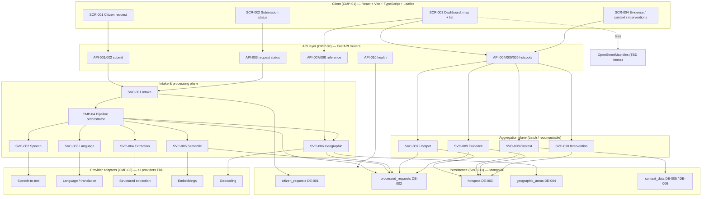
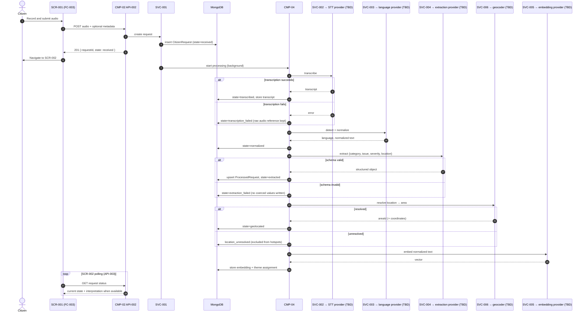
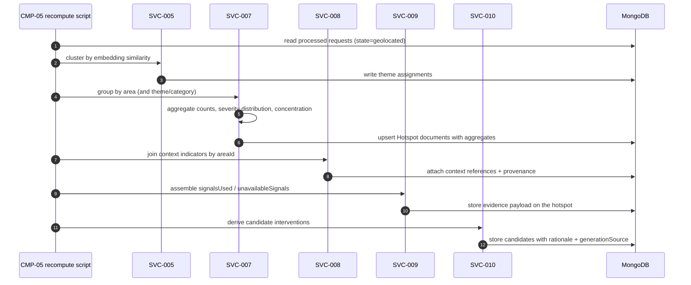
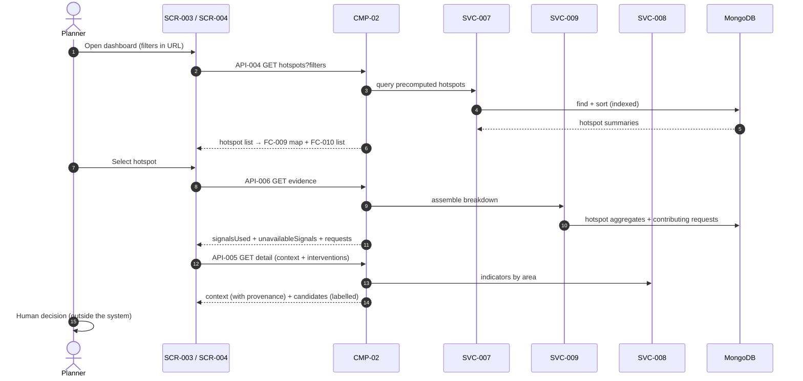
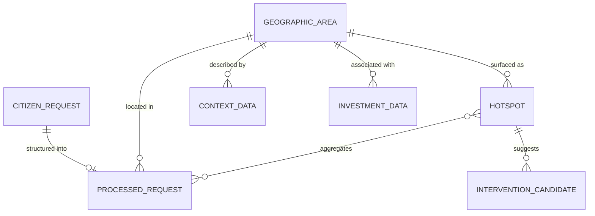

# Technical Architecture Document

**Product name:** TBD — working name **"CivicSignal"** *(Proposed)*
**Document:** TAD.md
**Version:** 0.1 (Draft)
**Status:** Draft — derived from PRD.md v0.1 and FSD.md v0.1
**Depends on:** `PRD.md` (FR/NFR/UC IDs), `FSD.md` (SCR/FC/API IDs)

> Classification labels (**Confirmed / Derived / Proposed / TBD**) carry the same meaning as in PRD.md §0. No provider, model, dataset, endpoint or schema field below is Confirmed unless explicitly labelled Confirmed.

---

## Table of Contents

1. [System Overview](#1-system-overview)
2. [Architecture Style](#2-architecture-style)
3. [Technology Stack](#3-technology-stack)
4. [System Components](#4-system-components)
5. [Architecture Diagram](#5-architecture-diagram)
6. [Data Flow](#6-data-flow)
7. [Data Architecture](#7-data-architecture)
8. [Database](#8-database)
9. [API Architecture](#9-api-architecture)
10. [AI Architecture](#10-ai-architecture)
11. [Geospatial Architecture](#11-geospatial-architecture)
12. [Hotspot Logic](#12-hotspot-logic)
13. [Explainability](#13-explainability)
14. [Authentication and Authorization](#14-authentication-and-authorization)
15. [Security](#15-security)
16. [Performance](#16-performance)
17. [Scalability](#17-scalability)
18. [Deployment](#18-deployment)
19. [Observability](#19-observability)
20. [Technical Risks](#20-technical-risks)
21. [Architecture Traceability](#21-architecture-traceability)

---

## 1. System Overview

The system converts multilingual citizen voice and text requests into structured civic issues, groups them semantically and geographically, produces demand hotspots with the aggregates that justify them, joins those hotspots to available demographic / infrastructure / investment context, and presents the result to a policymaker as inspectable evidence plus candidate interventions.

Three planes:

1. **Intake and processing plane** — receives a citizen request, runs it through transcription (voice only), language handling, structured extraction, geographic association and embedding, and persists each stage's outcome with an explicit state.
2. **Aggregation plane** — a recomputable batch step that groups processed requests semantically and by area, generates hotspots, and attaches context. It reads from storage and writes back to storage; it does not sit in the citizen's request path.
3. **Serving plane** — read APIs for the dashboard: hotspots, evidence, context, interventions, reference metadata.

**Key architectural decision (Derived from NFR-001/NFR-002):** hotspots are **precomputed and stored**, not calculated per dashboard request. This keeps dashboard reads fast, keeps the demo independent of live AI availability (NFR-007), and keeps the expensive work out of the user-facing path.

**Confirmed product constraint the architecture must enforce:** the system is decision-support. There is no component anywhere in this architecture that makes, ranks-as-authoritative, or commits a policy decision. Every priority signal is stored together with the aggregates that produced it (see §13).

---

## 2. Architecture Style

**Modular monolith.** Classification: **Confirmed direction** — "A modular monolithic FastAPI backend is acceptable and should be preferred over unnecessary microservice complexity for the MVP."

One FastAPI application. Inside it, clearly separated modules with explicit interfaces:

```
backend/app/
├── main.py                  # FastAPI app, router registration, CORS, startup
├── config.py                # settings from environment variables
├── api/                     # HTTP layer only — routers, request/response models
│   ├── requests_router.py
│   ├── hotspots_router.py
│   ├── reference_router.py
│   └── health_router.py
├── services/                # SVC-001..SVC-010 — business logic, no HTTP types
│   ├── intake_service.py
│   ├── speech_service.py
│   ├── language_service.py
│   ├── extraction_service.py
│   ├── semantic_service.py
│   ├── geo_service.py
│   ├── hotspot_service.py
│   ├── context_service.py
│   ├── evidence_service.py
│   └── intervention_service.py
├── providers/               # thin adapters over external AI / geocoding services
│   ├── base.py              # protocol definitions
│   └── ...                  # concrete adapters — provider TBD
├── repositories/            # SVC-011 — all MongoDB access
├── models/                  # Pydantic domain models (DE-001..DE-008)
├── pipeline/                # orchestration of the processing stages
└── scripts/                 # seed.py, recompute.py  (FR-016)
```

**Rules that make this modular rather than merely layered:**
- Routers never touch the database or a provider directly; they call services.
- Services never import FastAPI types.
- Every external AI/geocoding call goes through `providers/` behind a protocol, so the **TBD** provider decision can be made — or swapped — late without touching business logic. This is the single most important structural decision given PRD A-04 and A-05.
- Repositories are the only place MongoDB queries exist.

**Explicitly rejected for the MVP** (per the Confirmed "avoid over-engineering" constraint): microservices, Kubernetes, event buses, message brokers, MLOps tooling, data warehouses, custom model training.

**Task execution (Proposed):** the processing pipeline runs as a FastAPI `BackgroundTask` after the raw request is persisted, so the submit endpoint returns immediately (NFR-002). A dedicated worker process and queue are **not** introduced — the volume does not justify it. If the team finds background tasks unreliable for the demo, the documented fallback is synchronous processing with an extended client timeout, which is simpler than adding a broker.

---

## 3. Technology Stack

### Frontend
| Item | Choice | Classification |
|---|---|---|
| Framework | React | **Confirmed** |
| Build tool | Vite | **Confirmed** |
| Language | TypeScript | **Confirmed** |
| Maps | Leaflet | **Confirmed** |
| Routing / server state / styling | React Router · React Query (or `useAsync` fallback) · CSS custom properties | **Proposed** — see FSD §1 |

### Backend
| Item | Choice | Classification |
|---|---|---|
| Language | Python | **Confirmed** |
| Framework | FastAPI | **Confirmed** |
| Validation | Pydantic | **Derived** (ships with FastAPI's model layer) |
| Server | An ASGI server (e.g. Uvicorn) | **Proposed** — standard for FastAPI |
| Mongo driver | An official Python MongoDB driver, sync or async | **Proposed**; sync vs async choice **TBD** |

### Database
| Item | Choice | Classification |
|---|---|---|
| Database | MongoDB | **Confirmed** |
| Geospatial indexing | MongoDB `2dsphere` where point/geometry queries are needed | **Proposed** — see §8.3 |

### AI services
| Capability | Status |
|---|---|
| Speech-to-text (FR-003) | Capability **Confirmed**; provider/model **TBD** |
| Language detection (FR-004) | Capability **Confirmed**; provider/model **TBD** |
| Translation / normalization (FR-004) | Capability **Confirmed**; provider/model **TBD** |
| Structured extraction (FR-005) | Capability **Confirmed**; provider/model **TBD** |
| Embeddings / semantic similarity (FR-007) | Capability **Confirmed**; provider/model **TBD** |

**No provider or model name is asserted anywhere in this document.** All five capabilities are accessed through `providers/` protocols so that one or several vendors can satisfy them.

### External services
| Item | Status |
|---|---|
| OpenStreetMap — base map tiles and/or geographic & infrastructure data | **Confirmed direction**; tile source and usage terms **TBD** |
| Geocoding service | Capability **Confirmed**; exact service **TBD** |
| Public demographic data (incl. Census 2011 where appropriate) | **Confirmed as a potential source**; specific extract **TBD** |
| Public infrastructure dataset | **TBD — requires verification** |
| Public investment/planning data (incl. any JJM API or download) | **TBD — requires verification. Access was NOT verified and must not be implemented or described as an existing integration.** |

---

## 4. System Components

| ID | Component | Responsibility | Traces to |
|---|---|---|---|
| **CMP-01** | Client / UI (React SPA) | All screens SCR-001…SCR-006; Leaflet rendering; no business logic | FSD |
| **CMP-02** | API layer (FastAPI routers) | HTTP surface, request/response models, validation, error envelope, CORS | API-001…API-010 |
| **SVC-001** | Intake service | Accept text/audio, persist the raw `CitizenRequest`, start the pipeline, own request state transitions | FR-001, FR-002, FR-006, FR-015 |
| **SVC-002** | Speech service | Adapter over the speech-to-text provider; attach transcript; record failure | FR-003 |
| **SVC-003** | Language service | Detect language; translate/normalize where required; preserve original text | FR-004 |
| **SVC-004** | Extraction service | Prompt the extraction model; validate the returned object against the expected schema; reject rather than coerce | FR-005 |
| **SVC-005** | Semantic service | Generate embeddings; group semantically similar requests; assign theme identifiers | FR-007 |
| **SVC-006** | Geographic service | Geocode location text; associate requests with reference areas; mark unresolved | FR-008 |
| **SVC-007** | Hotspot service | Aggregate processed requests into hotspots with their supporting figures | FR-009, FR-010, FR-014 |
| **SVC-008** | Context service | Load and join demographic / infrastructure / investment indicators by area, each with provenance | FR-011 |
| **SVC-009** | Evidence service | Assemble the "Why this region?" breakdown: signals used, their values, signals unavailable, contributing requests | FR-012 |
| **SVC-010** | Intervention service | Produce candidate interventions with rationales; label generation source | FR-013 |
| **SVC-011** | Persistence / repositories | All MongoDB reads and writes; index management | FR-006, NFR-001 |
| **CMP-03** | Provider adapters | Uniform interfaces for STT, language, extraction, embeddings, geocoding; timeouts, retries, error normalization | NFR-007 |
| **CMP-04** | Pipeline orchestrator | Sequence the stages, record state transitions, isolate stage failures | FR-006, NFR-002 |
| **CMP-05** | Seed / recompute scripts | Load synthetic datasets; rebuild clusters, hotspots and context joins without re-calling AI providers | FR-016, NFR-007 |

---

## 5. Architecture Diagram



---

## 6. Data Flow

### 6.1 Conceptual flow (Confirmed)

```
Citizen → Voice/Text Input → Speech-to-Text (if required) → Language Detection /
Translation / Normalization → AI Structured Extraction → Structured Citizen Request →
Semantic Processing → Geographic Association → Clustering / Aggregation →
Demand Hotspots → Contextual Data Join → Evidence / Explainability → Policymaker Dashboard
```

### 6.2 Sequence — voice request submission (UC-002)



**Failure isolation principle (Derived from NFR-007):** each stage writes its own outcome. A failure at any stage leaves the request recoverable and inspectable; it never deletes earlier results and never invents later ones.

### 6.3 Sequence — hotspot generation (batch, FR-009)



**Note:** recompute is AI-free by design — it reuses stored embeddings and extractions (PRD R-13, AC-022). Only seeding consumes AI provider quota.

### 6.4 Sequence — dashboard read (UC-003, UC-004)



---

## 7. Data Architecture

Conceptual entities. **Not every entity is a separate MongoDB collection** — the mapping is stated in §8.

### DE-001 — CitizenRequest
| Aspect | Detail |
|---|---|
| **Purpose** | The immutable record of what a citizen actually submitted (FR-001, FR-002, FR-006). |
| **Key fields** | `_id`; `channel` (`text` \| `voice`) **Confirmed**; `originalText?` **Confirmed**; `audioRef?` **Derived** (**TBD** whether audio is retained — NFR-010); `transcript?` **Confirmed** (FR-003); `submittedLanguageHint?` **Derived**; `locationText?`, `areaIdHint?`, `coordinates?` **Derived** (FR-008); `state` **Derived** (FR-006); `failureStage?`, `failureReason?` **Derived**; `createdAt` **Derived**; `dataOrigin` (`live` \| `synthetic` \| `curated`) **Proposed** — required so synthetic data is labelled everywhere (AC-014). |
| **Relationships** | 1 → 0..1 `ProcessedRequest`. |
| **Source** | Citizen submission, or seeded synthetic dataset. |
| **Ownership** | SVC-001. |
| **Lifecycle** | Created on submit; state updated by the pipeline; **never overwritten in its original text/transcript fields**. |

### DE-002 — ProcessedRequest
| Aspect | Detail |
|---|---|
| **Purpose** | The structured civic issue derived from a citizen request (FR-004, FR-005, FR-007, FR-008). |
| **Key fields** | `_id`; `requestId` → DE-001 **Derived**; `language` **Confirmed**; `normalizedText` **Derived** (FR-004); `translationApplied: bool` **Derived**; `category` **Confirmed**; `issue` **Confirmed**; `severity` **Confirmed** (scale **TBD**); `location` **Confirmed** (as extracted, free text); `areaId?` → DE-004 **Derived** (FR-008); `geoResolution` (`area` \| `coordinates` \| `unresolved`) **Proposed**; `embedding?` **Derived** (FR-007; storing vectors in Mongo is **Proposed**); `themeId?` **Derived**; `processedAt` **Derived**. |
| **Relationships** | Many → 1 `GeographicArea`; many → 1 theme; referenced by `Hotspot`. |
| **Source** | AI pipeline output. |
| **Ownership** | SVC-004 writes the structured fields; SVC-005 the embedding/theme; SVC-006 the area. |
| **Lifecycle** | Created after successful extraction; enriched by later stages; regenerated only by re-running the pipeline. |
| **Note** | No field is added here that no screen or aggregation consumes (Confirmed: "only fields actually needed by the product"). |

### DE-003 — Hotspot
| Aspect | Detail |
|---|---|
| **Purpose** | A geographic area identified as having concentrated demand, stored together with everything that justifies it (FR-009, FR-012). |
| **Key fields** | `_id`; `areaId` → DE-004 **Derived**; `themeId?` / `dominantCategory` **Derived**; `requestCount` **Confirmed** (evidence signal); `categoryBreakdown[]` **Confirmed**; `severityDistribution[]` **Confirmed**; `concentrationMeasure?` **Proposed** (definition **TBD**, §12); `timeWindow` **Proposed**; `contributingRequestIds[]` **Derived** (required by AC-010); `contextRefs[]` **Derived** (FR-011); `evidence` (signalsUsed / unavailableSignals) **Derived** (FR-012); `interventions[]` **Derived** (FR-013); `generatedAt` **Derived**; `algorithmVersion` **Proposed** (so a demo result is reproducible). |
| **Relationships** | 1 → 1 `GeographicArea`; 1 → many `ProcessedRequest`. |
| **Source** | Batch aggregation (SVC-007). |
| **Ownership** | SVC-007; evidence written by SVC-009; interventions by SVC-010. |
| **Lifecycle** | Regenerated wholesale on recompute; previous generation may be replaced. |
| **Hard constraint** | A hotspot document must never carry a priority figure without the component aggregates stored alongside it (NFR-012). |

### DE-004 — GeographicArea
| Aspect | Detail |
|---|---|
| **Purpose** | The canonical aggregation unit and the join key for all context data (FR-008, FR-011). |
| **Key fields** | `_id` / `areaId`; `name`; `adminLevel?` **TBD**; `centroid` (GeoJSON Point) **Derived**; `geometry?` (GeoJSON Polygon/MultiPolygon) **Derived** (**TBD** whether geometry is available for all areas); `parentAreaId?` **Proposed**; `source` + `vintage` **Proposed** (boundary provenance). |
| **Relationships** | 1 → many `ProcessedRequest`, `Hotspot`, `ContextData`. |
| **Source** | Reference dataset of ≈20–100 areas (Confirmed range; actual source **TBD**). |
| **Ownership** | Seeded reference data; read-only at runtime. |
| **Lifecycle** | Loaded once at seed; not modified by the application. |
| **Critical rule** | One canonical area set. Every dataset must be joined to *this* set or rejected — mismatched boundaries are a named risk (PRD R-10). |

### DE-005 — ContextData
| Aspect | Detail |
|---|---|
| **Purpose** | Demographic, infrastructure and geographic indicators per area (FR-011). |
| **Key fields** | `areaId` → DE-004; `indicatorKey`; `label`; `value?`; `unit?`; `source`; `provenance` (`synthetic` \| `public` \| `curated` \| `unavailable`) **Proposed but required** by AC-014; `vintage?`; `note?`. |
| **Relationships** | Many → 1 `GeographicArea`. |
| **Source** | Public demographic data (incl. Census 2011 where appropriate) — **Confirmed as potential, specific extract TBD**; OpenStreetMap-derived infrastructure indicators — **TBD**; other public infrastructure data — **TBD, requires verification**. |
| **Ownership** | SVC-008; loaded at seed. |
| **Lifecycle** | Static within a demo run. |
| **Rule** | Absence is represented as a row with `provenance: unavailable`, never as `value: 0` and never by omitting the indicator. |

### DE-006 — InvestmentData
| Aspect | Detail |
|---|---|
| **Purpose** | Public investment / planning information associated with an area (FR-011). |
| **Key fields** | `areaId`; `programmeName?`; `status?`; `amount?`; `period?`; `source`; `provenance`; `verified: bool`. |
| **Source** | ⚠ **TBD — requires verification.** A JJM API/download was discussed but **access was not verified**. This entity may be populated only with curated/mock data clearly labelled as such, or left empty with `provenance: unavailable`. No code path may present it as a live government integration. |
| **Ownership** | SVC-008. |
| **Lifecycle** | Static within a demo run. |

### DE-007 — InterventionCandidate
| Aspect | Detail |
|---|---|
| **Purpose** | A suggested response to a hotspot's identified problem (FR-013). |
| **Key fields** | `hotspotId`; `title`; `rationale`; `linkedSignals[]` (which evidence signals motivated it); `generationSource` (`ai` \| `curated`) **Proposed but required** by AC-016. |
| **Source** | **Proposed/TBD** mechanism — see §12.4. |
| **Ownership** | SVC-010. |
| **Lifecycle** | Regenerated with the hotspot. |
| **Rule** | Persisted with its rationale. A candidate without a rationale is invalid and must not be written. |

### DE-008 — ReferenceTaxonomy
| Aspect | Detail |
|---|---|
| **Purpose** | Supported languages, issue categories and severity levels, served to the client so nothing is hard-coded (API-008). |
| **Key fields** | `type` (`language` \| `category` \| `severity`); `code`; `label`; `order?`. |
| **Source** | **TBD** — the actual languages (PRD A-03), categories (A-13) and severity scale (A-14) are all undetermined. |
| **Ownership** | Seeded reference data. |

### 7.1 Entity relationships



---

## 8. Database

**MongoDB (Confirmed).** Rationale consistent with the stack: the processed request document is a natural aggregate (original text, structured fields, geo reference, embedding, theme), the schema is expected to change daily during a 7-day build, and GeoJSON with `2dsphere` indexing is native.

### 8.1 Collections (Proposed mapping)

| Collection | Entity | Notes |
|---|---|---|
| `citizen_requests` | DE-001 | Raw submissions. Append-oriented. |
| `processed_requests` | DE-002 | One document per successfully structured request. Kept separate from raw so raw input is never mutated by processing. |
| `hotspots` | DE-003 (+ embedded DE-007) | Interventions embedded rather than a separate collection — they are only ever read with their hotspot, and the volume is small. **Proposed.** |
| `geographic_areas` | DE-004 | Reference data, includes GeoJSON geometry where available. |
| `context_data` | DE-005 + DE-006 | One collection with an `indicatorType` discriminator. **Proposed** — the read pattern is identical (by `areaId`) and two collections would add joins for no benefit. |
| `reference_taxonomy` | DE-008 | Small reference lists. |

Embeddings are stored on `processed_requests` (**Proposed**). A dedicated vector database is **not** introduced — at ≤2,000 requests, similarity can be computed in memory during the batch step. Introducing a vector store would be over-engineering.

### 8.2 Indexing strategy (Proposed)

| Collection | Index | Purpose |
|---|---|---|
| `citizen_requests` | `{ state: 1, createdAt: -1 }` | Pipeline scans and status listings |
| `processed_requests` | `{ areaId: 1, category: 1 }` | Hotspot aggregation grouping (FR-009) |
| `processed_requests` | `{ themeId: 1 }` | Theme-based grouping |
| `processed_requests` | `{ requestId: 1 }` unique | Link back to DE-001 |
| `processed_requests` | `{ coordinates: "2dsphere" }` | Geospatial queries if point-based clustering is used (§12.2) |
| `hotspots` | `{ areaId: 1 }`, `{ dominantCategory: 1 }`, `{ requestCount: -1 }` | Dashboard filtering and ranking (API-004) |
| `geographic_areas` | `{ geometry: "2dsphere" }` | Point-in-polygon area resolution (§11.2) |
| `context_data` | `{ areaId: 1, indicatorKey: 1 }` | Context lookup per hotspot (API-005) |

### 8.3 Query patterns

1. **Dashboard list (API-004):** filtered find on `hotspots`, sorted by the ranking metric. Single indexed query; no aggregation pipeline at read time — this is what makes NFR-001 achievable without tuning.
2. **Evidence (API-006):** fetch one hotspot; fetch its `contributingRequestIds` from `processed_requests` with projection and pagination.
3. **Context (API-005):** find `context_data` by `areaId`.
4. **Area resolution (SVC-006):** `$geoIntersects` against `geographic_areas.geometry` for coordinate input; name matching for text input.
5. **Aggregation (batch):** group `processed_requests` by `areaId` (+ category/theme) — an aggregation pipeline, but it runs offline, not per request.

### 8.4 Data lifecycle

- Raw requests are never mutated after creation except for state and failure fields.
- Processed requests are regenerated only by re-running the pipeline for that request.
- Hotspots, evidence and interventions are fully regenerated on recompute; they are derived data and may be dropped and rebuilt.
- Reference data (areas, taxonomy) is loaded at seed and read-only thereafter.
- **Audio retention: TBD** (NFR-010). Until decided, the safe default is to transcribe and not persist the audio blob, storing only the transcript.

---

## 9. API Architecture

> ⚠ **No API contract was established in the project discussion.** Every endpoint below is **Proposed** and must match FSD §7 exactly once agreed. Nothing here should be treated as a settled interface.

### 9.1 Conventions (Proposed)
- REST-style resource paths under `/api`; version segment **TBD**.
- JSON in and out, except audio upload (`multipart/form-data`, **Proposed**).
- Pydantic models define every request and response; FastAPI generates the OpenAPI schema, which is the working contract between frontend and backend during the build.
- Plural resource nouns; sub-resources for derived views (`/hotspots/{id}/evidence`).

### 9.2 Endpoint organization

| API ID | Method + path (Proposed) | Router | Service | Maps to |
|---|---|---|---|---|
| API-001 | `POST /api/requests` | requests | SVC-001 | FR-001 |
| API-002 | `POST /api/requests/voice` | requests | SVC-001 → SVC-002 | FR-002, FR-003 |
| API-003 | `GET /api/requests/{id}` | requests | SVC-001 | FR-015 |
| API-004 | `GET /api/hotspots` | hotspots | SVC-007 | FR-009, FR-014 |
| API-005 | `GET /api/hotspots/{id}` | hotspots | SVC-007, SVC-008, SVC-010 | FR-011, FR-013 |
| API-006 | `GET /api/hotspots/{id}/evidence` | hotspots | SVC-009 | FR-012 |
| API-007 | `GET /api/areas` | reference | SVC-006 | FR-008, FR-010 |
| API-008 | `GET /api/metadata` | reference | SVC-011 | FR-004, FR-014 |
| API-009 | **TBD** — seed/recompute; **CLI script recommended over an HTTP endpoint** | — | CMP-05 | FR-016 |
| API-010 | `GET /api/health` | health | SVC-011 | NFR-011 |

### 9.3 Request/response patterns
- Reads return the resource directly; collections return `{ items, total }` (**Proposed**) so pagination can be added without a breaking change.
- Writes return the created identifier and the current state, not the eventual result — the pipeline is asynchronous (**Proposed**, PRD A-15).

### 9.4 Validation
- Pydantic models validate type, presence and bounds at the HTTP boundary; length and duration limits are **TBD** (PRD FR-001/FR-002 edge cases).
- Service-layer validation re-checks domain invariants (e.g. `areaId` exists) rather than trusting the boundary alone.
- **AI output is validated as untrusted input** — SVC-004 validates the extraction result against the expected schema and rejects rather than coerces (AC-006).

### 9.5 Error structure
Single envelope, identical to FSD §7.2:

```jsonc
{ "error": { "code": "…", "message": "…", "fields": { … }, "stage": "…" } }
```

Status mapping (**Proposed**): `400` validation, `404` unknown resource, `413` payload too large, `422` semantic validation, `502` upstream provider failure, `503` dependency unavailable, `500` unexpected. Internal exception details are never returned to the client.

### 9.6 Authentication / authorization
**None. TBD.** See §14.

### 9.7 CORS
CORS middleware restricted to the configured frontend origin(s), supplied by environment variable (**Proposed** implementation of the Confirmed security topic). Wildcard origins must not be used, even in the demo build — the API accepts unauthenticated writes (§14), so origin restriction is one of the few controls present.

---

## 10. AI Architecture

### 10.1 Where AI is used, and where it is not

| Stage | Mechanism | Type |
|---|---|---|
| Speech-to-text (FR-003) | External model | **AI** |
| Language detection (FR-004) | External model or library | **AI** |
| Translation / normalization (FR-004) | External model | **AI** |
| Structured extraction (FR-005) | External model with schema validation | **AI, validated deterministically** |
| Embeddings (FR-007) | External model | **AI** |
| Similarity grouping (FR-007) | Cosine similarity + threshold or clustering algorithm | **Deterministic** |
| Geographic association (FR-008) | Geocoding + point-in-polygon / name matching | **Deterministic** (external geocoder is a service, not a model) |
| Hotspot aggregation (FR-009) | Counting, grouping, distribution | **Deterministic** |
| Evidence assembly (FR-012) | Reading stored aggregates | **Deterministic** |
| Candidate interventions (FR-013) | **TBD/Proposed** — see §12.4 | Mixed; source labelled per item |

**Architectural principle (Derived from the Confirmed explainability requirement):** AI is used only where language understanding is genuinely required — transcription, translation, extraction, embedding. Everything that produces a number a policymaker will act on (counts, distributions, concentration, ranking) is deterministic and reproducible. This is what makes §13 possible: the explanation is not a narrative *about* a black box, it *is* the computation.

### 10.2 Provider abstraction

Every AI capability is defined as a protocol in `providers/base.py` — e.g. `TranscriptionProvider.transcribe(audio, language_hint) -> TranscriptResult`. Concrete adapters implement them. Consequences:

- The **TBD** provider decision (PRD A-04) does not block backend development; a stub adapter returning fixtures unblocks the frontend on day one.
- A provider can be swapped or a second added per capability without touching services.
- Timeouts, retry policy and error normalization live in the adapter, so failure behavior is uniform (NFR-007).

**No model or vendor name appears in this architecture.**

### 10.3 Structured extraction (FR-005)

- Input: normalized text + the category taxonomy (**TBD** contents) + the severity scale (**TBD**).
- Output contract: exactly `{ language, category, issue, severity, location }`. No additional fields — the Confirmed rule is that only fields the product needs are extracted.
- Output handling: parse → validate against the Pydantic model → check `category` is in the taxonomy and `severity` is in the scale → on any failure, write `extraction_failed` with the raw model output retained for debugging, and do not write a partial `ProcessedRequest`.
- Prompting strategy, few-shot examples and whether a structured-output mode is used: **TBD** (provider-dependent).

### 10.4 Embeddings and semantic similarity (FR-007)

- Embed the normalized text (and/or the extracted `issue` field — which is used is **TBD** and should be decided by testing against the ≈100 labelled examples).
- Similarity: cosine. Grouping approach **Proposed**: threshold-based agglomeration within a category, or DBSCAN over the embedding space. Threshold value **TBD** — it must be tuned against the labelled set, not guessed.
- Scale: at ≤2,000 requests an in-memory pairwise computation during the batch step is entirely adequate. No vector index, no ANN library, no vector database.
- **Degradation (Proposed):** if embeddings are unavailable, grouping falls back to the extracted `category` alone, and the hotspot is marked as category-only grouping so the evidence panel can say so.

### 10.5 AI output safety
AI-generated text (transcripts, translations, issue summaries, intervention rationales) is treated as untrusted content: stored as text, never executed, never interpolated into HTML, never used to build database queries (§15).

---

## 11. Geospatial Architecture

### 11.1 Geocoding (FR-008)
- Capability **Confirmed**; **exact service TBD**; OpenStreetMap-based geocoding is the Confirmed direction.
- Accessed through a `GeocodingProvider` adapter with timeout, retry and rate-limit handling (external geocoders commonly enforce usage policies — terms **TBD** and must be checked before bulk seeding, PRD R-13).
- Results are cached by normalized query string (**Proposed**) so re-seeding does not re-query.

### 11.2 Geographic association
Resolution order (**Proposed**):
1. Citizen-selected `areaId` → used directly (most reliable; this is why FC-005 offers area selection).
2. Device or provided coordinates → `$geoIntersects` against `geographic_areas.geometry`.
3. Extracted or typed location text → geocode → coordinates → step 2; or direct name match against area names.
4. None of the above resolve → `geoResolution: unresolved`. **Excluded from hotspot aggregation** and counted openly as unresolved (AC-009). No default area is ever assigned.

### 11.3 Geographic clustering
Primary aggregation is by **predefined area** (DE-004), not by free-form spatial clustering. Rationale: context data (demographics, infrastructure, investment) is published by administrative area, so the join only works if demand is aggregated to the same unit. Point-based spatial clustering across area boundaries is a **Proposed** secondary view only, and only if coordinate coverage turns out to be good (§12.2).

### 11.4 Hotspot calculation
See §12.

### 11.5 Map representation
- Base tiles from OpenStreetMap (**Confirmed direction**; tile provider and usage terms **TBD** — this must be checked, since heavy demo use of a public tile endpoint may violate its policy).
- Area geometry served as GeoJSON via API-007 (format **Proposed**).
- Hotspot intensity is carried as a plain numeric field on the hotspot document; the client applies the visual scale. The backend does not send colours.
- Areas without geometry are served with a centroid only, and the client falls back to markers (FSD §9.2).

---

## 12. Hotspot Logic

### 12.1 Conceptual pipeline (Confirmed shape)

```
Processed requests (geolocated)
    → geographic grouping (by areaId)
    → semantic / category grouping (by themeId or category)
    → aggregation (counts, severity distribution, category shares)
    → hotspot candidates (concentration rule applied)
    → evidence calculation (signals used + signals unavailable)
```

### 12.2 Algorithm status

| Approach | Status |
|---|---|
| **Deterministic aggregation by area + category/theme, with a concentration rule** | **Proposed as the MVP default.** Rationale: it is reproducible, explainable line by line, requires no tuning to produce a defensible result, joins directly to area-published context data, and cannot fail on the demo day. Given that explainability is the Confirmed core differentiator, the algorithm that is easiest to explain is the correct one. |
| **DBSCAN over coordinates and/or embeddings** | **Proposed / candidate only.** It was identified as a possible technical approach and is **not mandatory**. It is worth adopting only if coordinate coverage is dense and the demo geography has meaningful sub-area structure. If adopted, its parameters (`eps`, `min_samples`) must be documented and displayed as part of the evidence, because unexplained parameters undermine the explainability claim. |
| **Predictive / forecasting ML** | **Out of scope (Confirmed).** |

The chosen approach must be recorded in `Hotspot.algorithmVersion` so a demo result is reproducible and so the evidence panel can state which method produced it.

### 12.3 Aggregates computed (all deterministic)

| Signal | Definition | Status |
|---|---|---|
| `requestCount` | Number of geolocated processed requests in the area (within the time window) | **Confirmed** as an evidence signal |
| `categoryBreakdown` | Count and share per category | **Confirmed** |
| `severityDistribution` | Count per severity level | **Confirmed** |
| `concentrationMeasure` | A stated measure of geographic concentration — **definition TBD.** Candidates: requests per unit population, requests per area, share of a parent region's requests. Whichever is chosen must be named and its value shown, and it must not be normalized by a population figure that is unavailable for that area. | **Proposed / TBD** |
| `timeWindow` | The period the aggregate covers | **Proposed** |

### 12.4 Candidate interventions (FR-013)

**Mechanism: Proposed/TBD.** Two viable options, in preference order for a 7-day build:

1. **Curated mapping (Proposed default):** a documented, reviewable table from `category` (+ severity profile, + a context condition) → candidate intervention text. Transparent, instant, zero runtime dependency, and honest about being a rule table. Labelled `generationSource: curated`.
2. **AI-generated rationale over the evidence (Proposed alternative):** the extraction/generation model is given the hotspot's evidence and produces candidate responses. Labelled `generationSource: ai`.

Either way: every candidate is stored with `linkedSignals` and a rationale, and the UI labels it as a suggestion requiring human decision (AC-016). **No autonomous prioritization, ranking-as-authoritative, or decision output is produced by this or any other component** (Confirmed product principle).

### 12.5 Explicit prohibition
**No arbitrary composite "AI priority score" is produced.** If a ranking is needed for display order, the ranking metric must be a single named, displayed aggregate (e.g. request count), not an undisclosed weighted blend. This is a direct Confirmed constraint, not a stylistic preference.

---

## 13. Explainability

The system answers **"Why is this region being surfaced?"** by returning the actual computation, not a narrative about it.

### 13.1 Evidence payload (Proposed structure, satisfying FR-012)

```jsonc
{
  "signalsUsed": [
    { "key": "requestCount",      "label": "Citizen requests in this area", "value": 42 },
    { "key": "categoryShare",     "label": "Share reporting <category>",     "value": 0.67 },
    { "key": "severityHigh",      "label": "Requests marked high severity",  "value": 18 },
    { "key": "concentration",     "label": "<named measure>",                "value": 3.1, "unit": "…" },
    { "key": "population",        "label": "Population (source, vintage)",   "value": 12345 }
  ],
  "unavailableSignals": [
    { "key": "investmentAlignment", "label": "Associated public investment",
      "reason": "No verified data source available (TBD / requires verification)" },
    { "key": "infrastructureGap",   "label": "Infrastructure indicator",
      "reason": "Not available for this area" }
  ],
  "method": { "algorithm": "…", "algorithmVersion": "…", "timeWindow": "…" },
  "contributingRequests": [ /* references into processed_requests */ ]
}
```

### 13.2 Rules the implementation must honour

1. **Only signals actually used are listed as used.** A signal present in the data model but not used in producing the hotspot must not appear in `signalsUsed`.
2. **Unavailable signals are named, not omitted.** Silence about missing context is a transparency failure (AC-013).
3. **Every aggregate is traceable to documents.** `contributingRequestIds` lets a reviewer read the underlying citizen requests, in their original language and text (FR-012, AC-010).
4. **The method is disclosed** — which algorithm, which version, which window.
5. **No composite score without decomposition** (§12.5, NFR-012).
6. **Synthetic data is labelled as synthetic** wherever an evidence figure derives from it (`dataOrigin` on DE-001, surfaced through the evidence payload) — findings from the demo dataset must not be presentable as real-world findings (PRD R-08).

### 13.3 What explainability here does *not* claim
It does not claim causal inference, statistical significance, representativeness of the citizen sample, or policy correctness. The evidence describes **what was reported and counted**, not **what is objectively true about the region**. This limitation should be stated in the product (FSD SCR-005) as well as in this document.

---

## 14. Authentication and Authorization

**Status: none established — TBD.** (Confirmed: no final authentication/authorization model was established.)

**MVP position (Derived):** the prototype may be documented and built without authentication. Consequences that must be stated rather than hidden:

- API-001 and API-002 accept unauthenticated writes — anyone who can reach the API can submit requests.
- API-004…API-008 expose aggregated citizen data without access control.
- There is no role enforcement; the ROLE-01 / ROLE-02 distinction is a UI convention only.

**Controls applied instead (Proposed, partial mitigations only):**
- Seed and recompute are **CLI scripts, not HTTP endpoints** (FR-016) — the highest-impact operation is therefore not reachable over the network.
- CORS restricted to the known frontend origin (§9.7).
- Rate limiting is **Recommended, not implemented** (§15).

**Before any non-demo deployment, the following are required and currently undecided (TBD):** an identity mechanism, a role model separating citizen submission from analytical access, authorization checks on every read endpoint, and audit logging. These are listed as FUT-11 in the PRD, not as MVP work.

---

## 15. Security

Each item is marked **Planned** (intended to be implemented in the MVP) or **Recommended** (not implemented; a gap to state honestly).

| Topic | Measure | Status |
|---|---|---|
| Input validation | Pydantic models at the HTTP boundary; length and duration limits (values **TBD**); server-side validation is authoritative regardless of client checks | **Planned** |
| Injection prevention | MongoDB access only through the driver with parameterized documents; no string-built queries; never pass raw user or AI text into a query operator position | **Planned** |
| XSS | All user and AI text rendered as text in React; no `dangerouslySetInnerHTML` anywhere (FSD §10) | **Planned** |
| CSRF | Not applicable in the current design — no cookie-based sessions exist (there is no authentication). **If cookie-based auth is ever added, CSRF protection becomes mandatory.** | **N/A now / Recommended on change** |
| CORS | Explicit allowed-origin list from environment configuration; no wildcard | **Planned** |
| API security | Consistent error envelope that never leaks stack traces, provider errors, or database details to the client | **Planned** |
| Secrets management | All provider keys and the database URI in environment variables; `.env` excluded from version control; **no key ever reaches the frontend bundle** (AC-020) | **Planned** |
| AI provider credentials | Held server-side only; all provider calls are server-to-server. The browser never calls an AI provider directly. | **Planned** |
| Citizen data protection | No personal identifiers requested or stored; only the fields FR-005 defines plus location | **Planned** |
| Data minimization | Audio retention **TBD** — the safe default until decided is to transcribe and discard the audio blob (NFR-010) | **TBD** |
| Rate limiting | Would protect the unauthenticated submission endpoint from abuse and protect AI provider quota | **Recommended — not implemented** |
| Request size limits | Maximum text length and maximum audio payload size | **Planned**, values **TBD** |
| Transport security | HTTPS in any deployed environment | **Recommended** — depends on the hosting decision (**TBD**, §18) |
| Prompt injection | Citizen text is passed to AI models. Extraction output is schema-validated and constrained to a fixed taxonomy, which limits the blast radius; the model is never given tool access or database access. | **Planned** (mitigation), residual risk accepted for the prototype |
| Dependency hygiene | Pinned dependency versions | **Recommended** |
| Audit logging | Not present; would be required with authentication | **Recommended (future)** |

---

## 16. Performance

No SLA numbers are invented. Targets that would be useful but are not established are marked **TBD** and must be measured.

| Area | Approach |
|---|---|
| **Dashboard reads (NFR-001)** | Hotspots are precomputed (§1), so API-004 is a single indexed find rather than a runtime aggregation. Evidence and context are simple keyed lookups. Concrete latency budgets: **TBD — to be measured on the seeded dataset**, not asserted. |
| **AI processing latency (NFR-002)** | Dominated by external provider round-trips and therefore not controllable by this architecture. Mitigated structurally: the submit endpoint returns as soon as the raw request is persisted, and processing runs in the background with a polled status (API-003). |
| **Database indexes** | As specified in §8.2. The two indexes that matter most are `processed_requests {areaId, category}` for batch aggregation and `hotspots {areaId}` / `{requestCount:-1}` for dashboard reads. |
| **Map rendering** | ≈20–100 areas (Confirmed range) is a small render load. Geometry is served once and cached client-side; hotspot values are served separately from geometry so filter changes do not re-transfer polygons (**Proposed**). |
| **Frontend optimization** | Vite production build; route-level code splitting so the citizen page does not download Leaflet (**Proposed**). React Query de-duplicates the map/list shared query (FSD §2.6). |
| **Batch processing** | Clustering and hotspot generation run offline. At ≤2,000 requests an in-memory similarity computation is adequate; no streaming or partitioning is needed. |
| **Provider call efficiency** | Seeding batches provider calls where the provider supports it and persists every result, so recompute is AI-free (PRD R-13). Geocoding results are cached by query string. |

---

## 17. Scalability

**MVP position (Confirmed):** the hackathon prototype does not need production-scale infrastructure, and distributed systems, microservices, Kubernetes and event buses must not be introduced without a demonstrated need. None exists.

**What the architecture does today to keep a scaling path open (this is NFR-003):**

1. **Module boundaries that match future process boundaries.** Intake, AI processing, semantic/geo processing, hotspot generation and context enrichment are separate, independently testable modules communicating through function interfaces. Extracting any of them into a separate process later is a deployment change, not a rewrite.
2. **Batch work already separated from request-serving work.** The expensive path is already offline. Moving it to a scheduled job or a worker fleet requires no change to the API or the data model.
3. **Provider adapters isolate external limits.** Swapping to a higher-throughput or self-hosted provider touches one file per capability.
4. **Derived data is rebuildable.** Hotspots, evidence and interventions can be dropped and regenerated from `processed_requests`, so a change in the aggregation method never requires a data migration.
5. **Area-keyed data model.** Every context dataset joins on `areaId`, so adding areas or a second region is a data operation, not a schema change.

**Realistic growth path, in the order the constraints would actually bind:**

| Stage | Trigger | Change |
|---|---|---|
| 1 | Current MVP | Single FastAPI process + MongoDB; batch via script. |
| 2 | Submissions outpace background tasks | Move the pipeline to a scheduled or queued worker process (same codebase, same modules). |
| 3 | Requests exceed in-memory similarity comparison | Introduce an approximate-nearest-neighbour index or a vector store for FR-007 only. |
| 4 | Many regions / much larger corpora | Shard or partition `processed_requests` by region; consider read replicas. |
| 5 | Multi-tenant government use | Authentication, authorization, audit logging (FUT-11) — required before this stage, not after. |

None of stages 2–5 is MVP work.

---

## 18. Deployment

**Hosting provider: TBD.** No platform was confirmed; no cloud or PaaS provider is assumed anywhere in this document.

### 18.1 Local development (the environment that must definitely work)
- Frontend: Vite dev server with a proxy to the backend origin (**Proposed**).
- Backend: ASGI server with reload.
- Database: a local MongoDB instance or a container.
- Containerization with Docker Compose is **Proposed** — it makes the demo environment reproducible across team machines, which is a real 7-day risk (PRD R-12). It is optional if the team is faster without it.

### 18.2 Build
- Frontend: `vite build` → static assets. Serving them from the FastAPI application as static files is **Proposed**, because it collapses the demo to a single deployable unit and removes a CORS variable.
- Backend: standard Python packaging with pinned dependencies.

### 18.3 Environment variables (Proposed names; values TBD)

| Variable | Purpose |
|---|---|
| `MONGODB_URI` | Database connection |
| `MONGODB_DB` | Database name |
| `ALLOWED_ORIGINS` | CORS allow-list |
| `STT_PROVIDER_*` | Speech-to-text credentials and endpoint (**provider TBD**) |
| `LANGUAGE_PROVIDER_*` | Detection/translation credentials (**TBD**) |
| `EXTRACTION_PROVIDER_*` | Extraction credentials (**TBD**) |
| `EMBEDDING_PROVIDER_*` | Embedding credentials (**TBD**) |
| `GEOCODER_*` | Geocoding endpoint/key and contact identification if the service requires it (**TBD**) |
| `MAP_TILE_URL` | Base tile source (**TBD**) |
| `LOG_LEVEL` | Logging verbosity |

No secret is ever exposed to the frontend build; only non-secret values (e.g. the tile URL) may reach the client.

### 18.4 Production deployment concept
At an abstraction level, since the provider is **TBD**: one container or process running the FastAPI application (optionally serving the built frontend), one managed or hosted MongoDB instance, TLS termination in front, and configuration by environment variables. Nothing in the architecture constrains the choice of host.

### 18.5 CI/CD
**Recommended, not required for a 7-day build:** a single pipeline running type checks, linting and tests on push. Automated deployment is not recommended for this timeframe — it costs setup time and adds a failure mode close to the demo. **Proposed minimum instead:** a documented, tested manual deploy procedure and a rehearsed demo runbook (PRD R-12).

---

## 19. Observability

**No monitoring or APM product has been selected — TBD.** Nothing below claims a tool exists.

| Area | Approach | Status |
|---|---|---|
| **Logging** | Structured (JSON) application logging with a correlation identifier generated at intake and carried through every pipeline stage, so one citizen request can be traced end-to-end in the logs | **Proposed** |
| **External call logging** | Every provider call logs capability, duration, and outcome — indispensable for diagnosing a demo-time failure | **Proposed** |
| **Error handling** | Stage-level exception capture; failures written to the request document (`failureStage`, `failureReason`) as well as the log, so failures are visible in the product, not only in a terminal | **Planned** |
| **Health checks** | API-010 returns application status and database reachability (AC-023) | **Planned** |
| **Pipeline visibility** | A small operational summary (counts by request state, unresolved-location count, extraction failure count) — valuable both for debugging and for honest reporting of data quality in the demo | **Proposed** |
| **Monitoring / alerting / tracing** | Not selected | **TBD** |
| **Log retention and PII** | Citizen request text must not be logged in full at INFO level; identifiers only | **Proposed** (NFR-010) |

---

## 20. Technical Risks

| ID | Risk | Likelihood / impact | Mitigation in this architecture |
|---|---|---|---|
| TR-01 | AI provider unavailable, slow, or rate-limited at demo time | Medium / High | Provider adapters with timeouts and normalized errors; the dashboard reads only precomputed data, so the analytical demo does not depend on a live AI call (NFR-007, AC-021) |
| TR-02 | Speech recognition accuracy across the supported languages | Medium / Medium | Transcript always stored and displayed, so errors are visible rather than silently propagated; curated voice samples for the scripted demo portion |
| TR-03 | Translation accuracy degrading extraction | Medium / Medium | Original text never overwritten; both original and normalized text retained and shown in evidence (FC-015) |
| TR-04 | Multilingual extraction quality (wrong category/severity) | Medium / High | Schema + taxonomy validation rejects out-of-vocabulary values; ≈100 labelled examples used as a check; original text shown next to the interpretation |
| TR-05 | Geocoding failures and ambiguous place names | High / Medium | Resolution ladder (§11.2) with citizen area selection as the most reliable input; unresolved requests excluded and counted openly, never defaulted to an area |
| TR-06 | Sparse or missing area geometry | Medium / Medium | Centroid-marker fallback in the map; geometry optional in DE-004 |
| TR-07 | Synthetic-data bias shaping hotspots | High / Medium | `dataOrigin` on every request; synthetic provenance surfaced in evidence; no real-world claims made from demo data (§13.2 rule 6) |
| TR-08 | Public dataset unavailable (infrastructure, investment, incl. any JJM source) | High / Medium | Context modelled per-indicator with a `provenance` field including `unavailable`; the UI and the evidence payload both state what is missing; **no code path assumes an unverified integration exists** |
| TR-09 | Provider API rate limits during bulk seeding of 1,000–2,000 requests | High / High | Seed once and persist everything; recompute is AI-free; geocoding cached by query string |
| TR-10 | Boundary mismatch between datasets | Medium / High | One canonical `geographic_areas` set; joins that cannot match it are rejected at seed time rather than silently mis-joined |
| TR-11 | Background tasks unreliable or lost on restart | Medium / Medium | Every stage persists its state, so an interrupted request is identifiable and re-runnable; documented synchronous fallback rather than adding a broker |
| TR-12 | Demo environment failure (no confirmed host) | Medium / High | Full local runnability is a first-class requirement; hosting decided early; manual deploy over CI/CD in this timeframe |
| TR-13 | Unauthenticated write endpoint abused | Low (demo) / Medium | CORS restriction; request size limits; rate limiting **recommended but not implemented** — stated as an open gap |
| TR-14 | Public map tile usage policy violated by demo load | Medium / Low | Tile source and terms **TBD** — must be checked before the demo; tile URL is configurable |
| TR-15 | Scope creep from optional differentiators into the MVP | Medium / High | Architecture contains no component for simulation, natural-language querying, or intervention traceability; adding one would be visible as a new module, not a quiet extension |

---

## 21. Architecture Traceability

| PRD requirement | Service(s) | API(s) | Data entity(ies) | Frontend (FSD) |
|---|---|---|---|---|
| FR-001 | SVC-001, SVC-011 | API-001 | DE-001 | SCR-001 / FC-001, FC-002 |
| FR-002 | SVC-001 | API-002 | DE-001 | SCR-001 / FC-003 |
| FR-003 | SVC-002 | API-002, API-003 | DE-001 | SCR-002 / FC-007 |
| FR-004 | SVC-003 | API-001…API-003, API-008 | DE-002, DE-008 | SCR-001 / FC-004 |
| FR-005 | SVC-004 | API-003 | DE-002 | SCR-002 / FC-007 |
| FR-006 | SVC-001, SVC-011, CMP-04 | API-001…API-003 | DE-001, DE-002 | SCR-002 / FC-007 |
| FR-007 | SVC-005 | API-004 | DE-002, DE-003 | SCR-003 / FC-010 |
| FR-008 | SVC-006 | API-001, API-007 | DE-002, DE-004 | SCR-001 / FC-005; SCR-003 / FC-009 |
| FR-009 | SVC-007 | API-004 | DE-003 | SCR-003 / FC-009, FC-010 |
| FR-010 | SVC-007, SVC-006 | API-004, API-007 | DE-003, DE-004 | SCR-003 / FC-009, FC-011 |
| FR-011 | SVC-008 | API-005 | DE-005, DE-006 | SCR-004 / FC-013 |
| FR-012 | SVC-009 | API-006 | DE-003, DE-002 | SCR-004 / FC-012, FC-015 |
| FR-013 | SVC-010 | API-005 | DE-007 | SCR-004 / FC-014 |
| FR-014 | SVC-007 | API-004, API-008 | DE-003, DE-008 | SCR-003 / FC-008, FC-010 |
| FR-015 | SVC-001 | API-003 | DE-001, DE-002 | SCR-002 / FC-007 |
| FR-016 | CMP-05, SVC-005, SVC-007, SVC-011 | API-009 (**TBD**, CLI preferred) | DE-001…DE-006 | — |
| NFR-001 | SVC-007, SVC-011 (§16) | API-004 | DE-003 + indexes | SCR-003 |
| NFR-002 | CMP-04, CMP-03 | API-001…API-003 | DE-001 | SCR-002 |
| NFR-003 | §2, §17 | — | — | — |
| NFR-004 | §15 | all | — | FSD §10 |
| NFR-007 | CMP-03, CMP-05, §20 | all | derived data rebuildable | FSD §10 |
| NFR-010 | §8.4, §15 | — | DE-001 | — |
| NFR-011 | §19 | API-010 | — | — |
| NFR-012 | SVC-009, §12.5, §13 | API-006 | DE-003 | SCR-004 / FC-012 |
